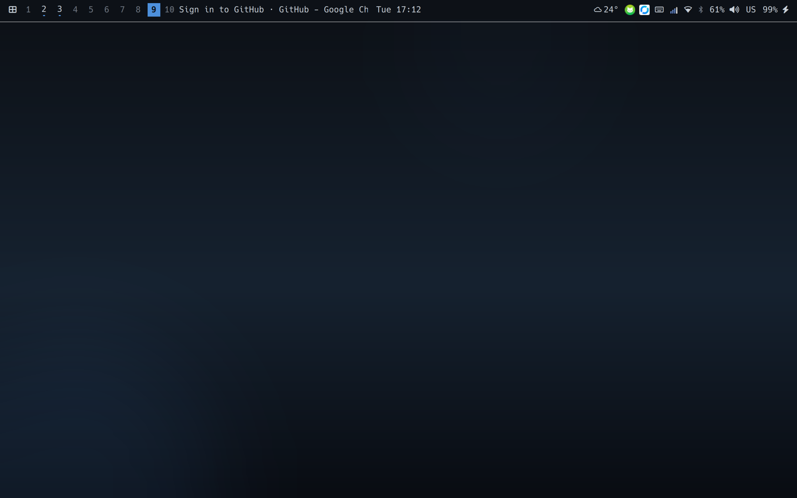
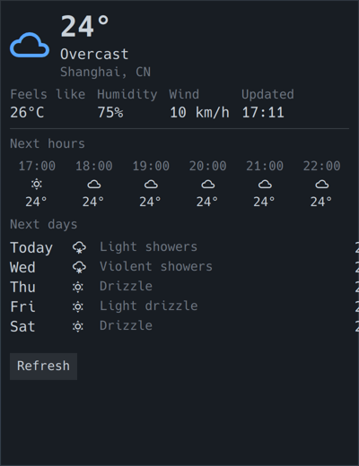
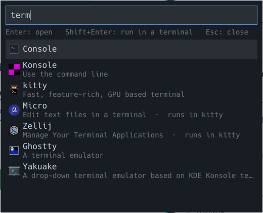
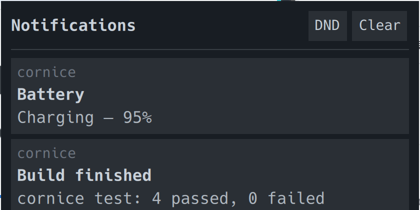
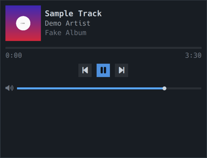
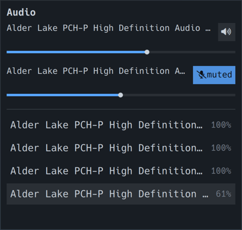
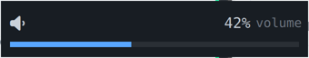
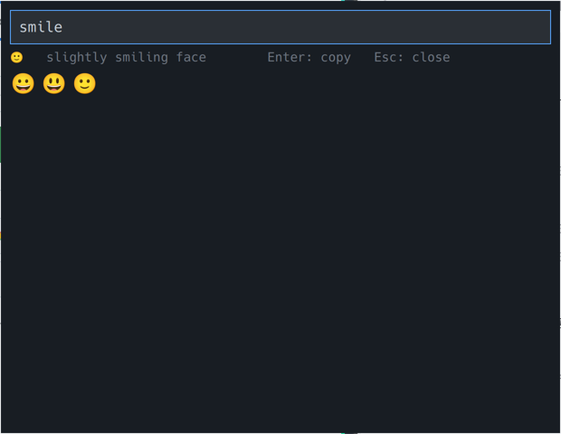
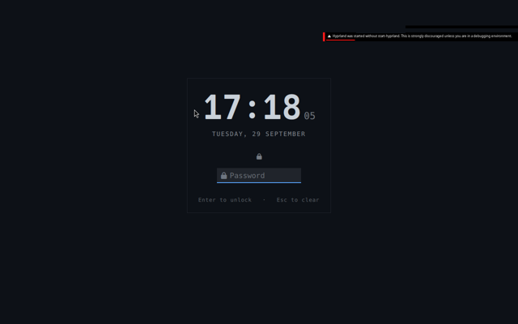

# Cornice

[English](README.md) · **中文**

基于 [Quickshell](https://quickshell.org) 的通用 **Hyprland shell**：一个进程提供
状态栏、各种面板、通知、启动器、锁屏、idle 处理与 polkit 认证代理 —— 用来替掉
waybar + mako + hypridle + hyprlock + polkit-gnome + 一个启动器 这一串各自带配置
文件的组合。



---

## 功能

| | |
| --- | --- |
|  |  |
| **状态栏** — 工作区、当前窗口、媒体、时钟、指示器、托盘、网络、蓝牙、音频、电量、键盘布局、天气、电源 | **天气** — open-meteo 实时天气与预报（无需 API key）；定位顺序为城市 → 经纬度 → 时区 → IP |
|  |  |
| **启动器** — 桌面条目、实时过滤，`>` 前缀进入命令行模式 | **通知** — 自己持有 `org.freedesktop.Notifications`：弹窗、历史、免打扰、动作按钮、内联回复 |
|  |  |
| **媒体** — 封面、进度、播放控制、音量、多播放器切换 | **音频** — 输出/麦克风音量、设备列表 |
|  |  |
| **OSD** — 音量/麦克风/亮度，跟随硬件按键 | **emoji 选择器** — 可搜索，回车即复制 |
|  | |
| **锁屏** — 走 PAM，背景用壁纸；账号名默认显示、可关掉 | |

其余功能（不配截图）：

- **面板** — 时钟/日历、网络（WiFi 列表与连接）、蓝牙（扫描/配对/连接）、电源（电量、性能模式、会话操作）
- **剪贴板** — 基于 cliphist 的历史：打字过滤、回车复制、图片预览
- **锁屏** — 走 PAM 的 Wayland session lock；优雅退出时自动释放，PAM 不可用则拒绝锁屏，并文档化"锁客户端死掉"时的 TTY 应急路径
- **Idle** — dim / 灭屏 / 锁屏，AC 与电池分别配置；睡眠前、`loginctl lock-session`、**合盖**都会锁屏
- **polkit 代理** — 认证对话框就在 shell 里
- **壁纸** — 静态背景层，支持按工作区覆盖；检测到 mpvpaper/hyprpaper/swaybg/swww/wbg 时自动让位
- **主题** — `mono`（深色）与 `dawn`（浅色），可运行时切换
- **IPC** — shell 自带 socket，插件各自持有 target，所有面板都能脚本化

## 依赖

- Hyprland（Wayland 会话）
- Quickshell —— `sudo pacman -S quickshell`（Arch `extra`）
- `jq`（或 `python3`，用于读插件清单）、`glib2`（监听 logind）、`curl`（天气）
- 一款 Nerd Font 用于状态栏字形 —— `ttf-nerd-fonts-symbols`
- 可选（按功能）：`socat`（CLI 访问运行时插件）、`grim`（`cornice verify` 截图）、`wpctl`/WirePlumber（音频）、`bluez`（蓝牙）、`brightnessctl`（亮度 OSD）、`cliphist`（剪贴板历史）、`light`（idle dim）、`NetworkManager`（网络面板）

## 安装

```bash
git clone https://github.com/mainliufeng/cornice.git ~/Code/self/cornice
cd ~/Code/self/cornice
./install.sh                 # 软链 CLI 到 ~/.local/bin，顺便体检依赖
```

`./install.sh` 默认安装到用户目录，不会改动合成器配置：

```bash
./install.sh --copy              # 装成自包含的一份到 ~/.local/share/cornice
./install.sh --prefix /usr/local # 换个前缀
./install.sh --takeover          # 顺便从 mako/hypridle/waybar 接管
./install.sh --uninstall         # 只删二进制（配置与状态保留）
make install                     # 等价于 ./install.sh
```

Arch 用户可以直接打包：`make pkg`（`makepkg -si`，装到 `/usr/share/cornice`，
CLI 软链到 `/usr/bin`）。要发 AUR 的话 [docs/aur.md](docs/aur.md) 里有 AUR 版
PKGBUILD 与上传流程。

然后启动它 —— 推荐用 systemd 用户服务，挂掉了会自动拉回来：

```bash
./install.sh --service       # 安装并启用 cornice.service（Restart=always）
systemctl --user status cornice
```

`--service` 会先检查依赖并安装全部辅助命令，再启用服务。服务启动路径跟随
`--prefix`；已有用户服务文件会先备份为同目录下的 `cornice.service.backup.*`。
撤回时，将安装输出中提示的备份复制回 `cornice.service`，然后运行
`systemctl --user daemon-reload`。

或者自己在 `~/.config/hypr/hyprland.conf` 加一行：

```conf
exec-once = cornice-launch
```


可选的键位片段在 [`config/snippet.hyprland.conf`](config/snippet.hyprland.conf)，
自己挑着贴。Cornice 不会改你的合成器配置、`~/.config/hypr/*` 或任何系统包。
显式使用 `--service` 时，会按上文安装并备份用户服务文件；
`cornice takeover --apply` 会备份后修改桌面启动配置，并支持
`cornice takeover --undo` 撤回。

## 从旧组件接管

```bash
cornice takeover            # 只出计划：会改什么、为什么
cornice takeover --apply    # 注释掉那些行、停掉对应的 systemd 用户单元
cornice takeover --undo     # 恢复最近一次备份
```

它会找出 cornice 所替代组件的 `exec-once` 行与 systemd 用户单元
（mako/dunst/swaync、hypridle、waybar、polkit 代理），用标记注释掉（**不删除**），
把所有改动过的文件备份到 `~/.local/state/cornice/takeover/<时间戳>/`，
并且不碰 cornice 会协作的东西（cliphist、hyprsunset、mpvpaper/hyprpaper/swaybg）。
之后 `hyprctl reload` 即可。

## 命令

```bash
# 生命周期
cornice start | stop | restart | status | logs | health
cornice launch                       # 前台运行，带看门狗

# 观察运行中的 shell
cornice ping | version | plugins | widgets | targets | socket | path
cornice config | theme [list|toggle|<name>] | reload | reload-plugins
cornice ipc <target> <method> [args] # 原始 IPC，例如 cornice ipc idle status

# 也可以脚本化配置（面板调用的就是这些命令）
cornice bar list | show <id> | hide <id> | move <id> up|down|left|center|right
cornice weather place use <名字> [--city 城市 | --lat 纬度 --lon 经度] | clear
cornice clock zone use <名字> <时区> | clear
cornice language [list|<语言>]

# 绑键用的
cornice launcher | clipboard | emojis | notifications | dnd [on|off]
cornice panel <plugin-id> [json]     # 开关任意面板
cornice osd volume | microphone | brightness | hide
cornice lock [status|try <密码>|emergency-unlock]
cornice background [status|set <路径>|next|prev|clear|reload]

# 机器相关
cornice doctor                       # 依赖、合成器、冲突
cornice verify                       # 检查你正在看的这个 shell
cornice takeover [--apply|--undo]
cornice test [--quick|installer|takeover|headless|lock|install|live]
cornice session-env                  # 输出合成器环境变量（TTY / 过期 shell 用）
```

## 天气地区与时区（各只有一个）

天气只有一个地区、时钟只有一个时区，而且都是**从列表里选**，不用手输：天气面板和
时钟面板各有一个搜索框，输入即筛选真实结果（城市检索；时钟复用同一份检索，因为每个
城市结果都带时区），点一行即设定。

```json
{
  "weather": { "place": { "name": "北京", "latitude": 39.9075, "longitude": 116.39723 } },
  "clock":   { "zone":  { "name": "東京", "timezone": "Asia/Tokyo" } }
}
```

名字来自搜索结果，而搜索是**按当前语言**发出的 —— 所以同一个地方，英文界面下是
`Beijing`，中文界面下是 `北京`。状态栏把它显示在数值前面：天气 `☁ 北京 20°`，
时钟 `東京 00:03`（没配时区时，时钟组件显示本地时间）。

```bash
cornice weather place use "北京" --lat 39.9075 --lon 116.39723   # 也可 --city 北京
cornice weather place clear
cornice clock zone use "東京" Asia/Tokyo
cornice clock zone clear
cornice clock zones            # 列出系统里所有可用时区
```

老配置继续可用：`weather.locations` 或 `clock.worldClocks` 列表会被读取其第一条。
写入有保护：写前备份、解析失败回滚、顶层键变少回滚；并且 CLI 是唯一写入者（面板调用
的就是这些命令，所以点出来的结果和脚本改出来的结果不会不一致）。


## 配置

`~/.config/cornice/config.json` 会深合并到 [`config/default.json`](config/default.json)
之上，所以只写与默认不同的部分即可。数组是替换，对象是合并；
`cornice config` 打印合并后的结果。

| 键 | 默认 | 含义 |
| --- | --- | --- |
| `theme` | `"mono"` | `mono`（深色）或 `dawn`（浅色） |
| `background.enabled` | `true` | 是否绘制壁纸层 |
| `background.dir` | `~/Pictures/wallpapers` | 扫描图片的目录 |
| `background.mode` | `"fill"` | `fill` / `fit` / `stretch` / `center` / `tile` |
| `background.perWorkspace` | `{}` | 按工作区覆盖，如 `{"2": "/path/to.png"}` |
| `background.force` | `false` | 即使 mpvpaper/hyprpaper 在跑也要接管 |
| `notifications.takeover` | `true` | 通知总线名空出来时自动抢回 |
| `notifications.inlineReply` | `true` | 向客户端声明支持内联回复 |
| `weather.city` | `""` | 城市名（走地理编码，优先级最高） |
| `weather.latitude`/`longitude` | `null` | 直接给经纬度 |
| `weather.autoLocate` | `true` | 无 city/经纬度时：先时区、再 IP |
| `weather.useTimezone` | `true` | 时区优先于 IP（开了代理也不会定位到出口节点） |
| `weather.unit` | `"metric"` | `metric` 或 `imperial` |
| `weather.intervalMinutes` | `15` | 刷新间隔 |
| `idle.dimAc` / `dimBattery` | `60` / `0` | 多少秒后 dim 背光 |
| `idle.screenOffAc` / `screenOffBattery` | `120` / `300` | 多少秒后灭屏 |
| `idle.lock` | `300` | 多少秒后锁屏 |
| `idle.respectInhibitors` | `false` | 是否也尊重应用的 idle inhibitor |
| `idle.lockOnSleep` | `true` | 睡眠前锁屏 |
| `idle.lockOnLockSignal` | `true` | 收到 `loginctl lock-session` 时锁屏 |
| `idle.lockOnLidClose` | `true` | 合盖锁屏（接了外接屏时跳过） |
| `lock.showUser` | `true` | 锁屏是否显示账号名 |
| `lock.background` | `"wallpaper"` | `wallpaper` / `screenshot` / `none` |
| `lock.blur` / `lock.scrim` | `1.0` / `1.0` | 锁屏背景的模糊与压暗强度 |

`cornice ipc idle inhibit 3600` 可以让 idle 链暂停一小时（下大文件、演示、跑测试），
`cornice ipc idle release` 提前结束。


## 插件

一个插件就是一个带 `manifest.json` 的目录加若干 QML 文件；内置的在
`shell/plugins/`，你自己的放 `~/.config/cornice/plugins/<id>/`。入口点会收到
`host`（shell 本体：`config`、`services`、`summon`、`toggle`）与 `plugin`（清单）；
状态栏 widget 还会收到 `widgetConfig`。

**完整指南：[docs/plugin-api.md](docs/plugin-api.md)** —— 类型、service 模式、
`PanelFrame`、`ShellIpc`、主题规则，以及那些已经踩过的坑。

## 资源占用

用 `./test/benchmark.sh --compare` 在 3072x1920 会话实测（PSS，12 秒窗口，23 个
插件全部加载）：

| 组合 | 内存 | 空闲 CPU |
| --- | --- | --- |
| cornice | ~200 MiB | ~0.1% |
| waybar + mako + hypridle | ~46 MiB | ~0.2% |

cornice 这个进程更大，原因值得直说：它跑的是 Qt Quick 运行时，而且比那三个守护
进程多干了不少活（锁屏、polkit 代理、启动器、剪贴板历史、emoji、通知中心与七个
面板、天气、媒体控制）。同样方法做的归因：

| 组成 | 代价 |
| --- | --- |
| 裸 Quickshell + 1 个 layer surface | 62 MiB |
| 每个额外 layer surface | ~5.5 MiB，且只在可见时 |
| 壁纸层 | ~15 MiB |
| 所有状态栏 widget 合计 | ~1 MiB |
| 其余 | 插件 QML 树、服务单例（PipeWire/BlueZ/NetworkManager/MPRIS/托盘）与字体缓存 |

所以地板是运行时本身，不是泄漏也不是某个插件：我试过把音频/媒体面板改成惰性
加载，实测零收益（隐藏的 surface 不占内存），于是保留"点开即现"。
`./test/benchmark.sh` 可复现这些数字，`--json` 便于脚本消费。

## 测试

```bash
cornice test                 # 全部套件（几分钟）
cornice test --quick         # 只跑快的
./test/install-verify.sh --package   # 全新安装是否真的能用？
```

| 套件 | 覆盖内容 |
| --- | --- |
| `test/headless-verify.sh` | 私有合成器（headless mutter → 嵌套 Hyprland）：启动、全部插件、全部 widget、全部面板、通过 D-Bus 送达通知、内联回复、用本地假 API 测天气、logind 信号、实际绘制 |
| `test/lock-verify.sh` | 私有合成器：锁屏、锁屏时拒绝重启、应急解锁、真实 PAM 栈 + 错密码、logind 锁信号、合盖锁屏 |
| `test/takeover-test.sh` | 沙盒：takeover 的计划/应用/幂等/备份/撤销，含假 systemctl |
| `test/install-verify.sh` | 导出**被跟踪的**树并安装，再对安装后的树跑 headless 套件 —— "全新安装"门禁 |
| `cornice verify` | 你正在看的这个会话 |

headless 套件还需要 `pipewire`、`wpctl` 和 `pw-metadata`。它会启动一个仅含虚拟输出、
不接硬件的私有 PipeWire 服务，检查顶部和底部状态栏的提示延迟、布局稳定、静音与滚轮操作。

插件加载失败、面板打开是空的、takeover 注释错行、全新安装缺文件 —— 这些都会让
套件失败。它们之所以存在，是因为每一种都真的发生过。

## 设计说明

[DESIGN.md](DESIGN.md) 记录了架构决策、与 omarchy/Caelestia 的对比，以及刻意
不做的部分。

## 许可

MIT —— 见 [LICENSE](LICENSE)。`wallpapers/` 里自带的那张壁纸是本项目生成的
（见 [wallpapers/CREDITS.md](wallpapers/CREDITS.md)）；cornice 不自带任何照片。
