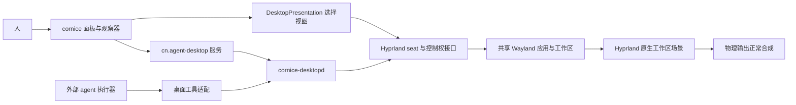

> 历史设计/验证记录：内置任务编辑、执行器和 prompt 专属输入/语音路径现已删除；现行外部 Harness 用法见 desktop-harness.md。

# cornice agent 桌面：对接设计

状态：**完整设计目标；已进入特性分支实施**。日期：2026-10-07。
最初设计保存在 `codex/agent-desktop-design`；实现保存在 `codex/agent-desktop`，不合入 main。
仅在私有嵌套实例验证 fork，不替换或重启本机正在使用的 Hyprland。

后续实施记录和可运行命令见 [特性使用与测试](agent-desktop.md)。设计稿中的候选接口
与 C–E 阶段不因此自动成为已实现能力；该文档明确标出当前实际交付范围。

2026-10-07 补充设计：每 Agent 默认配置私有虚拟输出，并区分人的桌面锁与标准
全会话锁，见 [Session lock 设计](agent-desktop-session-lock-design.md)。这部分尚未实现；
以下原设计中“所有锁屏都撤销 Agent”的规则仅对应当前实现及标准全会话锁。

## 1. 产品结果与已确认的约束

cornice 增加一个「Agent 桌面」入口。人可以创建多个 agent 桌面、分配初始
工作区、启动应用与任务，查看真实执行状态和桌面画面，并暂停或接管。

延续已确定的模型：一个 Hyprland 进程、一个物理屏幕、多个输入 seats。
每个 seat 有独立鼠标、键盘焦点和当前 workspace；窗口、工作区、文件与应用数据共享。
输出在这里提供工作区的尺寸与坐标基准，不由某个 seat 独占；人的物理屏幕仍显示人的当前 ws。
agent 在 ws10、人在 ws1 时，agent 的截图来自 ws10，不改变人的物理输出。
两者也可以选择同一个 ws、操作同一个窗口；应用内部的插入位置、选区和数据仍可能冲突。
「请只在 ws10 操作」是任务提示，本版本不增加 workspace ACL。

**人的观察状态另外保存**。选择 agent 只是选择观看对象，不能等同于改变人的
输入 seat，更不能通过切换 agent 的真实 ws 达成只读浏览。

功能分为三层，分别验收：

| 层 | 用户得到什么 | 需要完成的能力 |
| --- | --- | --- |
| 桌面与工具 | 多个 agent 在后台操作、截图、启动应用 | cornice 桌面管理、原生输入桥、实际执行器工具绑定 |
| 观察 | 默认只读跟随，也可浏览其他已有 ws | 独立观察视图与工作区帧导出 |
| 接管 | 人控制原 agent seat，agent 停止桌面写入 | 合成器控制权交接、输入清理、恢复时重新观察 |

## 2. 当前代码能提供什么

本次读取 cornice 的 shell、插件、CLI、安装器、测试及 fork 源码。
Hyprland fork 基线是
[`094edb1`](https://github.com/mainliufeng/Hyprland/commit/094edb17fae6cf0f637dce70e6e4b2019db67576)，
现有多 seat 验证见
[fork 记录](https://github.com/mainliufeng/Hyprland/blob/094edb17fae6cf0f637dce70e6e4b2019db67576/docs/verification/cornice-shared-workspaces.md)。

| 部分 | 已有能力 | 对接时的实际缺口 |
| --- | --- | --- |
| Hyprland | `seat create/list/workspace/focus/capture/remove`；后台 ws 输入与截图 | 能力协商、稳定生命周期身份、结构化截图元数据、独立只读浏览、连续帧、控制权交接 |
| cornice shell | `host.services`、插件宿主、Unix socket IPC、bar/面板/overlay | 没有 AI 桌面服务、输入驱动、观察器或执行器适配 |
| 工作区与窗口 | `Quickshell.Hyprland` 读人的焦点，窗口切换 helper | 现有控件是人的桌面控件，不能直接拿来驱动 agent |
| 会话与安装 | CLI 环境恢复、takeover/undo、安装验证、嵌套测试 | agent 服务必须固定目标实例，不能自动寻找另一个活跃会话；原生组件还需构建与打包 |

还有一个迁移前置：宿主安装的是 Hyprland `0.56.2-3`、Quickshell `0.3.1-1`。
当前 fork 的配置管理器只创建 Lua provider；`dispatch` 接收 `hl.dsp...` 表达式。
cornice 现有工作区按钮、窗口聚焦 helper、DPMS 和部分重启路径仍使用旧语法。
因此不能只换 `/usr/bin/Hyprland` 就宣布对接完成，必须迁移配置并验证这些现有功能。

## 3. cornice 里的使用流程

### 桌面面板

栏上新增可选组件「Agent 桌面」。默认只显示数量与需要注意的状态；点击打开面板。
每个桌面一行：名称、真实当前 ws、当前窗口、任务状态、控制者与最后更新时间。
常用操作是「观察」「启动任务」「暂停桌面输入」「停止任务」；管理菜单放
初始工作区、应用启动配置、删除桌面。运行状态必须来自执行器确认，不能从窗口存在
或 seat 存在推断 agent 正在执行任务。

桌面先创建，应用随后启动。名称对应长期使用的 seat，任务轮次另有 run 身份，
避免每次任务都销毁重建 seat，影响 GTK 客户端绑定。
新增 seat 后既有 GTK 3 应用可能需要重启；UI 必须显示这个兼容限制。

### 观察器

观察器支持窗口式和全屏式，使用人的默认 seat 接收自己的导航操作。
画面来自 agent 的工作区导出；不把人的应用、物理输出或 Wayland 连接迁给 agent。
首轮只提供一个可切换目标的观察器；内部 view 身份独立，后续增加多个观察器不改变模型。

```text
 Agent: 写作助手 ▾   跟随 · 只读   WS10   agent 正在运行
 [跟随] [浏览工作区 ▾]                         [接管] [返回我的桌面]
 ┌─────────────────────────────────────────────────────────┐
 │ 实际工作区画面；显示 agent 的真实光标                    │
 │ 人在这里点击、滚动或打字时，只读模式不转发给应用         │
 └─────────────────────────────────────────────────────────┘
```

| 模式 | 画面 | 人的操作 | agent 状态 |
| --- | --- | --- | --- |
| 跟随，只读，默认 | agent 真实当前 ws，含其光标 | 选择 agent、缩放、退出、转浏览；不转发应用输入 | 继续运行；agent 切 ws 后画面跟随 |
| 浏览，只读 | 人选择的已有 ws | 只改本地观察 ws；空白/已删除 ws 显示实际状态，不新建 ws | 真实 ws 和焦点保持不变 |
| 交接中 | agent 当前实际画面与交接提示 | 暂不接受目标应用输入 | 新桌面写请求被拒绝，旧请求与按下状态被清理 |
| 人接管 | 原 agent seat 的实际当前 ws | 键鼠进入该 seat；明确的桌面动作进入该 seat | 不接受 agent 的桌面写入 |
| 暂停/断线/锁屏 | 状态提示；锁屏立即清除已缓存画面 | 无目标应用输入；可以退出观察器 | 桌面写入被阻断，恢复须重新同步 |

浏览其他 ws 时同时显示「正在看 WS11；agent 实际在 WS10」，不在 WS11 画面上
绘制 WS10 的光标。点击接管时先回到 agent 的真实当前 ws，取得一帧新画面再交接；
不在只读状态里偷偷执行 `seat workspace`。

「返回我的桌面」关闭观察器并释放接管，不自动重放旧焦点或旧 ws 切换。
若人的真实 ws 已改变，不能把人拉回观察前的旧 ws。
退出接管后默认停在只读/暂停，由人明确选择恢复 agent。

### 暂停、停止与删除的语义

- 「暂停桌面输入」只保证桌面写入口停止；不能说外部 agent 的文件、终端或网络动作也已暂停。
- 「停止任务」调用执行器的取消接口，收到确认后才显示已停止；无确认则显示停止中/失败。
  只处理本任务管理的进程，不能按进程名杀用户其他 agent。
- 「删除桌面」撤销控制权、销毁 seat 和运行时资源，不关闭共享窗口。
  不提供一键关闭“这个 seat 的全部窗口”，因为窗口没有 seat 所有权。

## 4. 架构与职责



### QML 服务与插件

沿用已有 `host.services` 和 `ShellIpc`：

- `cn.agent-desktop`：service + bar-widget + panel，统一展示桌面、任务与控制状态。
- `cn.desktop-observer`：视图控制对象，保存 follow/browse 状态；不创建观察窗口，不保存控制权真值。
- `CompositorAdapter`：人的工作区、窗口、DPMS、启动等命令集中适配 Lua fork 和现有上游。
  老 compositor 保留通用 shell；缺少 seat 能力时明确报告 agent 桌面不可用。

QML 的 UI 不运行 AI 推理循环，不拼接任意 shell 命令，不持有每个 seat 的按键状态。
观察器只读时不建立目标输入通道；不能仅靠置灰按钮实现只读。

### 原生桌面服务

建议新增一个按需运行的 C++ 服务 `cornice-desktopd`，使用 Qt Core/Network 的
JSON 与异步 IPC、libwayland-client、xkbcommon；一个服务管理 N 个 seat 驱动。
它独立于 Quickshell 的 UI 生命周期，避免面板刷新或 shell 重载丢失控制状态。
现有通用 shell 仍在一个 Quickshell 进程里，未启用此特性时不启动辅助服务。

服务负责：固定目标 Hyprland 实例、seat 生命周期、原生虚拟键鼠、结构化截图、
应用启动、控制交接、执行器工具绑定和事件广播。
每个 seat 持有长期 Wayland 连接与独立输入设备；不为每次点击重新启动输入程序。

输入驱动从实际 seat 名称绑定 `wl_seat`，不通过 `uinput`、`ydotool` 或人的
全局 `dispatch` 注入。现有 fork 的测试输入程序只实现 ASCII `type`，不能直接当产品驱动。
产品 `text` 必须验证 UTF-8/中文、换行、组合键与布局；不承诺客户端没有实现的多 seat IME。
不能静默用人的剪贴板替代输入。

### 原生观察与输入

Agent 的单次截图复用工作区 renderer，并返回同帧元数据。人的连续观察由 Hyprland
直接把选定 Workspace 的场景合成到物理输出，沿用正常输出 damage/frame 调度。
Cornice 的 `DesktopPresentation` 只选择目标、续租、申请和释放接管，不接收应用像素。
没有 Qt 观察窗口、截图轮询、SHM 观察缓冲或 `human.input` 转发。

只读观察保留人的 Workspace/焦点/光标状态，可以独立浏览目标 seat 的工作区。
接管先撤销 Agent 输入与 CDP，再由合成器将物理鼠标、滚轮、键盘送到目标 seat。
目标 seat 使用独立快捷键状态、窗口动作上下文和输入法 relay；新启动应用继承目标
Wayland socket。Cornice 的控制栏和任务框仍属于人的 shell。

关闭观察、锁屏、输出消失或租约失效恢复人的场景；接管过的 Agent 保持暂停。
Agent 工具截图仍是按需导出，不参与人的观看路径。测试检查实际物理输出像素时钟、
原生合成帧数及真实输入效果，不能用接口请求次数证明刷新率。

## 5. 状态、接口与并发

### 三种身份分别保存

| 对象 | 关键字段 |
| --- | --- |
| Desktop | 逻辑名称、compositor 实例、seat 生命周期身份、display、输出几何、真实 ws、窗口/焦点、控制者与控制代次 |
| ObserverView | view 身份、目标 Desktop 生命周期、follow/browse、观察 ws、缩放与帧状态；不含应用输入焦点 |
| AgentRun | 运行身份、执行器、桌面绑定、工具连接、实际运行状态、停止确认、最后执行证据 |

不能使用显示名称、窗口标题或裸窗口地址作为长期唯一身份。
同名 seat 删除重建、合成器重启、窗口地址复用，都必须使旧引用失效。
配置保存的是名称、初始 ws、应用配置和执行器配置；租约、token、socket 与帧只放 runtime。

配置形状建议如下；这些字段也尚未进入当前配置 schema：
新安装默认关闭此特性；下面展示用户显式启用后的配置。

```json
{
  "agentDesktop": {
    "enabled": true,
    "desktops": [
      {"name": "writer", "initialWorkspace": "10", "output": "eDP-1"},
      {"name": "research", "initialWorkspace": "11", "output": "eDP-1"}
    ],
    "observer": {"defaultMode": "follow-readonly", "maxFps": 15},
    "executor": {"adapter": "external"}
  }
}
```

`desktops` 不限制为两个或三个；bootstrap 按配置创建，名称、输出和工作区字符串严格校验。
`initialWorkspace` 只用于首次创建，配置热重载不能把正在工作的 agent 拉回初始 ws。
服务重启先匹配同一实例中现存的生命周期身份；来源不明的 seat 不自动删除、接管或认领。
应用启动参数保存成 argv 数组，显式设置目标 display，清除继承的 `WAYLAND_SOCKET`/`DISPLAY`。
浏览器使用专用 profile，单例/DBus 行为按实际应用验证；不能复用人的日常浏览器 profile。

建议 runtime 路径为 `$XDG_RUNTIME_DIR/cornice/<instance>/desktop.sock`。
agent API 严格要求显式 instance，不复用 `cornice-env.sh` 的自动会话发现。
断线后不寻找另一个会话，不自动重放输入，不自动恢复人或 agent 的控制权。

### 外部接口候选

**以下是计划接口，不是目前可运行的 cornice 命令。**

```text
cornice desktop list
cornice desktop create writer --workspace 10 --output eDP-1
cornice desktop launch writer -- APPLICATION ARG...
cornice desktop observe writer                 # 默认只读跟随
cornice desktop pause writer                   # 暂停桌面写入
cornice desktop resume writer                  # 新截图/状态确认后恢复
cornice desktop remove writer                  # 保留共享窗口
cornice desktop doctor                         # 检查目标实例与能力
```

面板经 shell IPC 请求服务；高频桌面工具直接经 desktopd 的 JSON RPC，避免 Quickshell
现有同步字符串 IPC 承担连续输入。协议需有 request ID、结构化错误、超时与异步完成事件。
管理、只读观察和 agent 工具连接分别授予能力；控制者身份来自连接授权，不能靠请求中
自称 `owner=human` 获得接管权限。服务和 socket 只属于当前用户，凭证不进入命令行或日志。

工具集合：`desktop.state`、`desktop.capture`、`desktop.windows`、`desktop.input`、
`desktop.workspace`、`desktop.focus`、`desktop.launch`。
agent 自动携带绑定的 Desktop 生命周期和控制代次，不能临时省略 seat 退回人的桌面。
模型侧不暴露任意 compositor dispatch 或运行任意命令的桌面工具。

### agent 操作必须路由到绑定的 seat

人和 agent 可以使用相似的工具名称，但不能共用人的操作后端。以绑定 `agent1` 的
执行器为例，每个请求由服务端补齐并校验实例、seat 生命周期和控制代次，路由如下：

| agent 工具 | 实际目标与路径 | 不允许的替代路径 |
| --- | --- | --- |
| `desktop.workspace(10)` | 指定 `agent1` 的 seat 工作区接口；当前 fork 对应 `hyprctl seat workspace agent1 10` | 人的 `dispatch workspace`、工作区 widget 或模拟人的全局切 ws 快捷键 |
| `desktop.focus(window)` | 指定 `agent1` 的 seat 聚焦接口，校验窗口仍存在且可在该 seat 当前 ws 接受输入 | 人的全局 `focuswindow` helper |
| `desktop.input(...)` | SeatDriver 绑定 `agent1` 的 `wl_seat`，虚拟指针/键盘事件送入该 seat | 全局鼠标键盘注入、人的输入设备或只改变 `WAYLAND_DISPLAY` 后调用全局工具 |
| `desktop.capture()` | `agent1` 当前真实 ws 的截图，并返回该帧的 seat/ws 身份 | 人的屏幕截图或物理输出截图 |

虚拟键盘通过 `zwp_virtual_keyboard_manager_v1.create_virtual_keyboard(seat)` 创建，
虚拟指针通过 `zwlr_virtual_pointer_manager_v1.create_virtual_pointer_with_output(seat, output)`
创建；这里的 seat 必须是已校验的 agent seat。额外 Wayland socket 负责连接与应用启动，
不能代替输入设备的 seat 绑定。发送到应用的按键与 compositor 桌面动作分开处理；
切 ws、聚焦等必须使用 seat API，涉及 compositor 快捷键时只能启用经过验证的 seat 路由。

`desktop.input` 依据 agent 自己的截图，把坐标映射到该 seat 的工作区，再通过该 seat
命中窗口/Client。即使人的物理屏幕显示 ws1，也不能先把人切到 ws10 再点击。
若两个 seat 在同一 ws，事件仍带各自的 seat 身份；选中同一个 Client 时共享其应用状态。
目标 seat 丢失、身份不匹配或控制权被撤销时返回错误，不回退到默认 seat。
CLI 若提供这些工具动作，也必须走同一绑定与校验路径，不能另写一套人的快捷操作实现。

截图回复至少包含：frame ID、实例与 seat 身份、**这一帧实际渲染的 ws**、
输出位置/尺寸/scale/transform、像素尺寸、cursor、焦点窗口身份和采集时间。
截图与元数据由合成器一次生成；不能先 `seat list` 再截图并假设中间状态没变。
输入坐标依据该帧映射；换 ws、换输出变换或控制代次后拒绝旧帧动作。
letterbox、缩放和旋转必须纳入映射，不能把预览控件坐标直接当成工作区坐标。

工具成功意味着协议请求已处理，不意味着应用业务动作成功。
接管、恢复或状态变化后，执行器必须重新截图再计划动作。
重复的非幂等请求通过 request ID 去重；不默认重试一次点击或一次文本输入。

### 接管与失败行为

控制者与控制代次由合成器确认。desktopd 的队列门禁负责工具请求，Hyprland 的
输入门禁负责实际事件；只在 cornice 中暂停队列不能约束已经存活的虚拟设备。

交接顺序：阻断新写入 → 使旧代次失效 → 清理排队动作、按键/修饰键、按钮、
repeat、拖动、抓取、约束和 IME 状态 → 确认清理 → 取得新状态/画面 → 授予人控制。
释放事件可能完成应用动作，不能把状态清理描述为撤销已送达的编辑或点击。

人的接管在原 seat 上进行，不创建替代 seat。建议由合成器为当前观察器路由物理输入，
同时处理预览区域坐标；工具栏操作仍属于 cornice，目标应用区域操作才进入目标 seat。
人的全局快捷键不能继续在后台关闭人的窗口。普通桌面快捷键需按目标 seat 执行，
保留 compositor 级紧急退出组合键，例如 `Super+Alt+Esc`；不占用应用正常使用的 Escape。
这些路由能力未实现前不开放「接管」按钮。

归还、关闭、失焦与租约超时必须释放人的 held state，目标保持暂停。
恢复 agent 时授予新代次并交付新画面，不执行旧画面的动作计划。
合成器或服务重启、输出消失、seat 移除、标准全会话锁，都使当前写租约失效。
新增人桌面锁设计按 seat 策略保留或撤销 Agent 权限；人的接管与观察帧始终撤销，
解锁回到只读，不能自动恢复接管。具体协议和例外见补充设计；当前代码仍为全局撤销。
DPMS 的异步失败不能被当作成功；agent 活动不能延长人的锁屏/idle 截止时间。

此控制策略约束受管理的桌面输入，不是同 UID 的安全沙箱。
用户仍可管理共享会话；外部执行器的文件/终端能力由其自身权限机制管理。

## 6. Hyprland 必须补的接口

以下均为新设计，不计入上一轮已完成能力：

| 能力 | 要求 |
| --- | --- |
| capabilities | 明确协议版本、命令方言与可用特性；不能只用版本号或空 seat 列表判断全部能力 |
| desktop identity/events | 生命周期身份、真实 ws、焦点窗口身份、cursor、控制代次；可按事件重同步 |
| atomic snapshot | 截图内容与元数据来自同一场景；标准全会话锁拒绝，旧目标拒绝；未来人桌面锁仅允许获准 Agent 的绑定截图 |
| readonly workspace view | 引用已有 ws，不创建 seat/ws，不激活窗口、不修改实际 ws；仅有观察者时调度必要帧 |
| frame export | 按 view 导出工作区完整场景，含 popup；浏览别的 ws 时不画目标 seat 的错误光标；处理 buffer 生命周期 |
| input control/handoff | 撤销旧写入源与代次、清理输入状态、暂停、确认交接；旧虚拟设备不能继续输入 |
| physical takeover routing | 人的输入进入原 seat，视图坐标变换、快捷键目标、输入法、失焦与紧急退出行为一致 |

逐项发布能力位，cornice 只有在对应能力真实存在时才开放功能。
也要保持现有单 seat、共享窗口与 N-seat 的回归。

## 7. 本地替换 Hyprland 的交付方式

首轮采用**并存的本地 fork 会话**：固定提交的 Release 构建安装到独立版本目录，
独立 session launcher 与登录入口显式选择该二进制、配置和匹配的 hyprctl。
原 `/usr/bin/Hyprland` 和现有登录入口保留。这样本机开始使用 fork 就已经实现运行时替换，
不必先让所有入口都丢失回退路径。后续若要系统包替换，再使用单独 Arch 包管理冲突与回滚。

实施次序：

1. 记录当前二进制/包版本、配置、会话入口、用户服务与有效显示器/键位，备份到具名目录。
2. 针对当前 fork 编写独立 Lua 配置副本，逐项迁移显示器、输入、键位、规则、启动项与
   cornice snippet；原配置不覆盖，不通过全量正则转换假定行为等价。
3. bootstrap 必须在共享 GTK 应用启动前创建配置里的全部 seats，再启动 cornice 与应用。
   对无法控制启动顺序的既有应用明确要求重启；新增 seat 的热绑定不作为保证。
4. 在私有嵌套实例跑 cornice 全套验证，包括工作区按钮、窗口聚焦、全屏/最大化保留、
   launcher、通知、托盘、剪贴板、lock/PAM、DPMS、idle 和恢复。
5. 安装独立 fork 会话入口，核验文件/库与启动命令；不替换正在运行的 compositor。
6. 在下一次实际会话启动时选择 fork，做真实 GPU、输入、睡眠/唤醒和锁屏验收。
   这是需要会话切换的验证边界，不能用嵌套测试替代。

回退由专用 compositor 切换记录与 undo 命令管理，恢复原会话入口、配置和服务选择。
不要复用已有 `cornice takeover` 的名称作为 agent 接管：它现在表示 shell 接管
waybar/mako 等服务。agent 接管使用独立的 desktop control 接口。
会话存活期间不进行热替换；失败时从原登录入口或 TTY 恢复。

## 8. 文件落点与实施顺序

以下是待新增/修改位置，不是已经存在的实现：

| 位置 | 责任 |
| --- | --- |
| `shell/services/CompositorAdapter.qml` 与命令 helper | 人的现有 compositor 动作方言适配；工作区/聚焦/DPMS 等改为统一入口 |
| `shell/plugins/agent-desktop/` | Service、Widget、Panel 与 manifest |
| `shell/plugins/desktop-observer/` | 只读跟随、浏览、接管状态与返回入口 |
| `native/desktop/` | desktopd、SeatDriver、执行器工具协议与DesktopPresentation |
| `bin/cornice-desktop`、`bin/cornice-desktopd` | CLI 分发与服务启动；`bin/cornice` 增加 desktop 子命令 |
| `config/`、`install.sh`、`PKGBUILD` | 可选特性配置、native 构建/安装、独立 fork 会话与回退记录 |
| `test/agent-desktop-verify.sh` 等 | 真实嵌套对接、接管竞态、坐标与工具包兼容测试 |

原生服务和 QML 模块是平台二进制，不能继续按当前 `arch=('any')` 原样打包。
建议保留通用 shell 包，增加可选的平台相关 agent-desktop 包；模块缺失或特性关闭时，
不能因为 QML 顶层 import 失败而让其他 shell 插件启动失败。
安装器的复制路径与全新安装验证也必须包含原生程序、模块和协议版本。

| 阶段 | 实际交付与完成条件 |
| --- | --- |
| A：先打通兼容与后台操作 | capabilities/原子截图，人的旧功能适配；desktopd + CLI + 桌面服务；真实后台应用输入/截图，不改变人的 ws/focus/cursor |
| B：管理与只读观察 | 桌面面板、只读 view/连续帧、跟随/浏览；真实菜单与动态内容可看，人无论点击/打字/切观察 ws 都不能改变目标应用状态 |
| C：控制权交接 | 合成器 gate、输入清理、物理输入路由与恢复；旧 agent 输入实际被拒绝，紧急退出与崩溃后保持暂停 |
| D：执行器对接 | 将 DesktopHandle/工具端点注入实际本地执行器，任务输入、真实状态、停止确认、接管后重新截图；不在 cornice 重建另一套 AI 编排系统 |
| E：本地会话切换 | 独立 Release 安装与 Lua 配置完成、嵌套回归通过、真实 fork 会话与 cornice 对接验收、实际回退验证 |

先用 A 验证最高风险的兼容/真实输入链路，再做 B 的 UI。
B/C 中的合成器扩展需要在 Hyprland fork 同步开发；不能只在 cornice 画完 UI 就称实现。
未具备执行器适配时，只称桌面工具就绪，不称 AI agent 已能实际操作桌面。

## 9. 验收清单

保留「人 + 三个 agent、一个输出」真实基线，并覆盖：

1. agent 在隐藏 ws 输入、组合键、鼠标、拖放、中文、截图；人的实际状态不变。
2. 同 ws/同窗口的两个 seat 操作；共享应用数据影响如实体现，输入不误发给其他窗口。
3. 人跟随 agent 切 ws；人浏览 ws11 时 agent 仍在 ws10；只读指针/键盘/关闭快捷键
   不到达目标应用，不创建应用/ws，不改变焦点或 agent 截图来源。
4. 观察窗口尺寸、scale、transform 改变后的坐标映射；旧帧输入被拒绝。
5. 持有 Shift、鼠标按钮、IME preedit、popup grab 或 DnD 时接管；旧代次迟到请求、
   重复 RPC、同名 seat 重建、窗口地址复用均不会重新获得控制权。
6. 观察器、shell、desktopd、执行器分别崩溃，控制权与暂停状态符合设计；无残留后台进程。
7. 锁屏、DPMS 延迟/失败、正常 idle 与锁屏 deadline 竞态；无缓存画面泄漏，不自动恢复写入。
8. GTK 3、实际常用浏览器/编辑器/终端和 Qt/Quickshell 在 Lua fork 上逐项验证，
   特别检查多个 seats、应用单例、clipboard、菜单、IME 与全局快捷键。
9. 原生组件全新安装、Arch 打包、原 compositor 通用 shell 回归、实际会话切换与回退。

仅设计文档、构建成功、seat 数量、假进度或组件测试均不代表上述功能完成。
真实会话操作需要在切换后的本机验证，绝不在用户正在使用的旧会话中试锁屏或热替换。

## 10. 依据与保留问题

- 已核验源码：cornice `shell/shell.qml`、`services/PluginRegistry.qml`、`Commons/IpcRegistry.qml`、
  `plugins/workspaces/Widget.qml`、`plugins/idle/Idle.qml`、`bin/cornice-focus-window`、
  `bin/cornice-env.sh`、安装与嵌套测试。
- 已核验 fork：`src/config/ConfigManager.cpp`、`src/ipc/s1/Commands.cpp`、
  `src/managers/SeatDesktop.cpp`、`src/render/Renderer.cpp`；固定基线提交见 §2。
- [Quickshell 官方 ScreencopyView](https://quickshell.org/docs/v0.3.0/types/Quickshell.Wayland/ScreencopyView/)：
  现有来源类型与清除/停止行为。
- [Wayland 官方协议模型](https://wayland.freedesktop.org/docs/book/Protocol.html)：
  异步事件、对象身份与接口版本。观察、控制租约与 ws 生命周期是本项目额外契约。

执行器具体接入现有哪一套 runtime、常用应用兼容矩阵与连续帧实测性能，在实施阶段
通过真实接口/应用验证。本方案不假定 Codex/Pi/其他 runtime 已接入，也不引入新的模型服务。
上游 fork 的历史观察方案曾包含独占输出假设，不能直接当作当前实现说明。
