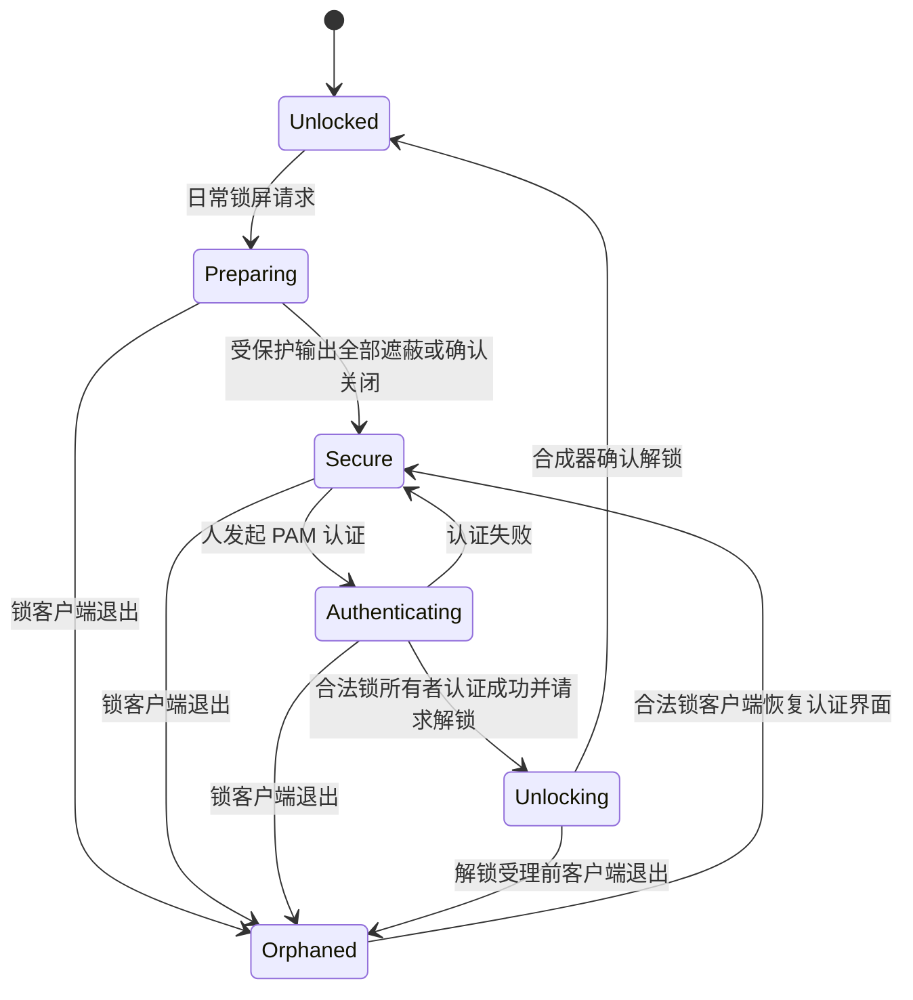

# Agent 桌面的 Session lock 设计

状态：**特性分支已实现，私有嵌套实例验证；新锁能力尚未替换日常会话**。日期：2026-10-07。
代码继续留在 cornice 的 `codex/agent-desktop` 和 Hyprland 的
`codex/cornice-agent-desktop`，不合入 main。当前物理会话仍运行先前的 `38351820`；新锁协议只能在匹配的新版二进制中启用。

## 1. 结果与边界

沿用一个 Hyprland、人的物理屏幕、N 个 Agent seat 的模型。每个 Agent 默认有一个
Cornice 管理的 headless 虚拟输出；鼠标、输入焦点、当前 Workspace 分别保存。
窗口和 Workspace 仍共享，不增加 Workspace 所有权或 ACL。

日常锁屏保护人的桌面：人的输入只能进入锁屏，人的输出只能显示锁屏或黑屏；
事先获准的、正在运行的 Agent 可以继续切 Workspace、操作应用、截图和使用受控 CDP。
人的观察器关闭画面通道；解锁后重新取帧。系统休眠期间不能执行任务。

这里的隔离是桌面控制契约，**不是同 Linux UID 下的进程安全沙箱**。
同 UID 的终端、文件、IPC 和网络访问不因这个设计自动隔离；Agent 的独立浏览器
profile 也不能保证所有应用的 DBus 单例、输入法与账户数据互不影响。

## 2. 协议决定：人的桌面锁与标准全会话锁分开

标准 `ext-session-lock-v1` 的 locked 事件要求停止普通客户端的输入和渲染，
所有输出的普通画面必须被遮蔽。只删除 Hyprland 的锁屏检查、继续向共享普通窗口
输入，却仍声称满足标准 locked 语义，是不成立的。
[协议原作者说明](https://isaacfreund.com/docs/wayland/ext-session-lock-v1/)

因此定义两种模式，而不是改变标准协议的含义：

| 模式 | 触发方式 | 人的桌面 | Agent |
| --- | --- | --- | --- |
| `human` 人桌面锁 | Cornice 日常手动锁屏、空闲锁屏、普通 logind Lock 通知 | 锁住人的输入和所有受保护输出 | 按预先批准的 seat 策略继续或暂停 |
| `session` 全会话锁 | 标准 ext-session-lock 客户端、显式锁全部、准备休眠 | 标准全会话锁 | 所有 seat 撤销桌面控制，不例外 |

`human` 使用新的私有 Wayland 协议，候选名称 `cornice_human_lock_manager_v1`，
其锁对象、锁 surface、事件使用独立接口名称。不得复用标准锁对象并偷偷缩小范围。
保留标准 `WlSessionLock` 作为全会话锁提供者。

能力不足时仍必须能执行原来的全会话锁，并明确报告实际 scope 和 Agent 被暂停的原因；
不能报告“后台继续”成功。新功能验收必须走真实 human 锁，不以这种回退代替交付。

## 3. 三类对象分别建模

### 锁状态

合成器是状态真值，至少返回：

```text
scope: none | human | session
phase: unlocked | preparing | secure | authenticating | failed | unlocking | orphaned
locked / secure: 合成器确认的输入阻断及全部受保护输出覆盖状态
lockId: 此轮锁的生命周期身份
lockEpoch: 每次锁边界或保护范围变化递增
protectedOutputs: 已遮蔽/关闭、正在等待覆盖的输出及生命周期身份
```

PAM 尝试状态由锁客户端提供，保护状态由合成器确认。密码校验失败时仍处于 secure；
“failed”不能被渲染或输入代码理解为已解锁。Cornice 的 `locked`/`secure` 应来自
同一轮合成器确认，不能只由 QML 布尔值或锁请求发送成功推断。

### Agent 状态

每个 seat 保存 `humanLockPolicy: pause | continue`、控制者、暂停状态、控制代次，
另有可用性与原因。缺少配置时使用 `pause`，显式启用新能力的 Agent 可设 `continue`。
策略由管理入口在未锁屏时配置，Agent 工具绑定不能修改策略、锁范围或解锁。

`continue` 只延续锁前已经获得的控制权。锁屏不自动恢复暂停的 seat，不创建新 seat，
不授予新 binding，不因配置热重载或服务恢复授予权限。已运行的 Agent 仍可以通过
原绑定启动任务需要的应用；这不等于授予新 seat 控制权。

### 输出角色

默认所有输出都是受保护输出，包括新插入的物理显示器、镜像输出和来源不明的虚拟输出。
只有 Cornice 创建并登记生命周期的 headless 输出才能标记为 `agent-private`；
不能把物理显示器改名后当作 Agent 私有屏幕，也不能复用同名已重建输出的旧授权。

私有输出不进入人的鼠标跨屏范围、焦点轮换、Workspace 导航或 shell 面板创建列表。
人通过只读观察器看它，接管通过明确的控制交接进入原 Agent seat。
所有物理输出始终属于锁保护范围，不能因为 Workspace 被 Agent 使用而排除。
私有输出向物理输出的直接镜像不开放；显式只读观察才是人看 Agent 画面的入口。

## 4. 新私有锁协议与 Cornice 锁提供者

私有协议只对受信任的锁提供者开放，锁授权绑定其 Wayland 连接和生命周期。
Agent 的工具凭证不具备锁管理权限。当前同 UID 管理模型仍不构成恶意进程隔离。

协议至少包含 request-lock、为受保护输出创建锁 surface、尺寸 configure/ack、
secure 确认、经锁所有者发起的 unlock-and-destroy、拒绝及接管遗失锁的流程。
secure 事件明确表示人的输入/输出已被保护，不使用标准 ext 协议的 locked 事件冒充。

锁 surface 必须由合成器赋予专用角色，不能是普通顶层窗口或 layer-shell 遮罩。
缺 surface 时由合成器输出不透明黑色；锁客户端退出、崩溃、销毁 surface 都不解除锁。
合法的新锁客户端可在同一锁轮次下恢复认证界面，不能因此恢复普通桌面。
锁提供者的 QML 对象销毁、shell 重载或退出不能自动发送 unlock；只有显式认证成功
或既有人工应急恢复路径可请求解锁。恢复锁所有者时递增所有者代次，拒绝旧连接请求。

普通 Cornice 使用 Quickshell 的 `WlSessionLock`，它提供标准全会话锁，
不能只改 QML 参数就接入私有协议。
[Quickshell 类型说明](https://quickshell.org/docs/v0.3.0/types/Quickshell.Wayland/WlSessionLock/)

Cornice 的 `cornice-human-lock` 原生进程实现真实 private/ext 锁 surface，通过
Qt Quick 的公开 QQuickRenderControl 软件渲染到 Wayland SHM；不使用普通全屏窗口。
它提供时钟、密码框、按钮、锁范围提示和真实 PAM 认证，支持 XKB 组合及按键重复。
密码经私有 stdin 传给短生命周期 PAM 子进程，不进入命令参数或日志；认证失败及
超时都保留锁，认证成功在合成器确认解锁后才报告完成。`showUser` 与 PAM 配置复用。
原生界面目前使用不透明背景；旧锁界面的壁纸、模糊、主题与指定主屏配置没有接入。
不具备全部旧锁界面的配置等价性。旧合成器保留原来的 Quickshell 标准锁路径。

保留 `hyprlock` PAM service 及现有认证规则。Agent 截图、窗口列表、输入命中、IME 和
CDP 都不得涉及锁 surface；密码只在锁客户端与 PAM 的现有认证路径流转。

## 5. 锁屏顺序与竞争处理



锁开始时在合成器线程先封住人的普通桌面输入、撤销接管，再更新范围和锁 epoch。
人的 held state、repeat、拖动、grab、约束和 IME 按实际控制交接顺序清理。
清理释放事件可能完成已开始的应用动作，不宣称撤销已经执行的编辑。

对 `pause` seat 撤销设备与控制代次；对 Agent 控制中的 `continue` seat 保留设备、
焦点、鼠标和控制代次。锁期间维持运行的 seat 仍需获得新截图才能发起下一次坐标输入：
输入帧校验增加 `lockEpoch`/`viewEpoch`，使锁边界前的动作依据失效而不撤销控制绑定。

若锁开始时人正在接管 Agent，先撤销人的接管并清理该 seat 的 held state，
目标保持暂停；即使策略是 continue，也不把人的控制自动转交 Agent。

人的观察帧先失效，随后受保护输出只能渲染锁场景或黑场景。必须确认每个开启的输出
实际呈现了覆盖帧，或关闭状态的提交已被确认，才报告 secure。超时不能仅靠计时器
宣布安全；转为合成器黑场景并等待真实确认。输出失败必须保持锁住并报告故障。

锁轮次与每次认证尝试均有身份。旧 PAM 回调、旧解锁消息、旧输出 ack 和旧帧不能
跨轮次使用。锁与 capture 并发时，以合成器受理顺序为准；已发出的旧画面不能追溯
撤回，但在边界后拒绝旧帧输入，且人侧 UI 不得再呈现该画面。
解锁消息若已经被合成器合法受理，随后客户端退出不能把已完成的解锁逆转为遗失锁。
logind 的 LockedHint 在 secure 确认后置为 true，解锁确认后清除；它不替代实际输出
确认，也不能用来推断 Agent 是否暂停。准备休眠必须等待全会话锁的安全确认。

## 6. 输入、渲染与导出的边界

人的物理及默认 seat 虚拟输入在锁期间仅进入锁 surface；原有锁屏允许的必要系统
按键单独保留。不得切普通 WS、聚焦应用、启动应用或将输入送入观察器后的窗口。
Agent 的合成器动作走 seat API，不通过人的全局快捷键或 dispatch。

获准 Agent 的命中测试仅限当前工作区的正常窗口树、应用 popup、自己 seat 的 IME
及拖动场景。即使这个 WS 是人锁前的可见 WS，也不得命中人的 bar、launcher、
通知、锁 surface 或其他 shell 层。人的物理输出不显示 Agent 光标。

Renderer 分开处理：

| 场景 | human 锁期间 | session 锁期间 |
| --- | --- | --- |
| 受保护输出的普通窗口、overlay、镜像 | 禁止；只允许锁场景/黑场景 | 标准锁行为 |
| 获准 Agent 的当前 WS 场景 | 允许私有输出或专用离屏目标渲染 | 禁止 |
| 人的 observer / 管理 capture / 浏览其他 WS | 拒绝新帧，清空实时缓存 | 拒绝 |
| Agent 的绑定 capture | 校验实例、seat 身份、控制代次及锁策略后允许 | 拒绝 |

离屏渲染使用局部 render context 标记，不改全局锁布尔值，不使用 session_lock_xray。
锁期间的 Agent 导出仅允许其实际当前 WS；不能借只读浏览参数导出任意其他 WS。
无凭证的旧 snapshot/capture 命令保持拒绝，新增受管理的导出授权而非仅凭 seat 名放行。
导出授权绑定实例、seat 身份、代次、当前视图和策略，通过私有 IPC/协议传递；
凭证不放进进程 argv、日志或共享截图文件。管理 capture 不能自行声明 Agent 身份。
普通 screencopy、image-copy-capture、镜像和 portal 路径也需审计，不能旁路得到应用帧。

窗口刷新依据是否被活动 Agent 视图使用，而不只依据 Workspace.visible()。
锁屏或物理 DPMS 关闭时，必要的 frame/FIFO 回调、解除 suspended 状态仍继续；
多个 seat 引用同一 WS 时去重，并限制频率。无需持续 PNG 编码来维持客户端更新。

共享 Workspace 仍只有一份布局和所属输出。Agent 引用人的 WS 时不搬动它，截图采用
该共享布局的坐标与尺寸，变化后递增 viewEpoch；不能承诺同一份布局同时具有不同尺寸。
Agent 默认的私有输出及其自身 WS 则可独立配置尺寸。物理 DPMS off 不使逻辑布局失效。

## 7. 关屏、热插拔、解锁与休眠

| 事件 | 规定行为 |
| --- | --- |
| 人的 DPMS off | 只关闭受保护输出；不影响私有输出、Agent 输入和离屏截图 |
| Agent 活动 | 不重置人的 idle 截止时间、不唤醒物理屏幕、不阻止正常锁屏 |
| 人触摸锁屏 | 按现有策略唤醒物理输出，先显示锁场景；不改变 Agent 状态 |
| 新接物理/未知输出 | 激活普通画面前纳入保护，先显示锁或黑场景；不先露出应用帧 |
| Agent 私有输出消失 | 暂停受影响 seat、撤销代次；不退回人的输出或移动共享窗口 |
| 人的物理输出消失 | 保留锁及恢复认证的能力；有效的 Agent 私有输出可继续 |
| human 解锁 | 保持运行中的 Agent 状态；已暂停、失联或曾被人接管的 seat 不自动恢复 |
| 人重新打开观察器 | 重新获取最新帧；不恢复旧 texture/SHM，也不自动接管 |
| 准备休眠 | 升级为全会话锁并暂停全部 Agent；确认安全后才能放行休眠 |
| 唤醒 | 仍锁住；确认输出/seat 状态后由人解锁、显式恢复所需 Agent |

human → session 升级先阻断全部 Agent、撤销代次、清空导出，再按标准全会话锁确认。
标准 ext 客户端必须参与真实全会话锁，不只是因为已有 human 锁而被当作完成。
session 生效后不能在锁期间降回 human 来恢复 Agent。升级中失败仍保持已有人的锁。
控制策略会暂停桌面操作，不声称停止已运行应用的网络请求或整个外部执行器。

## 8. Cornice、CDP 与故障

Broker 区分 observer buffer 与 Agent binding。human 锁清空并关闭 observer 通道，
continue Agent 的 driver 与 binding 不因人锁屏或关屏被 watchdog 误删；旧帧元数据
仍失效。查询状态分别报告 humanLocked、paused、可截图/可输入及不可用原因。
Broker 需把“截图过期，请重新截图”的可恢复错误与“输入状态不确定”的错误区分：
前者不撤销 continue Agent，后者仍暂停并撤销；不能沿用所有 input 异常一律暂停的分支。

manual pause、Broker 退出/崩溃/重启、合成器重启、seat 删除仍撤销控制权。
humanLockPolicy 不是自动恢复权限；服务重启识别原 seat 后必须保持暂停。

CDP 正式接入须经过绑定的受控连接，与 seat 共用生命周期、暂停及锁策略。
优先用 Chrome 调试 pipe 作为内部通道；对工具暴露的端点必须经过 Broker 授权，
不能同时留下可直接连接的原始调试端口。透明代理不能以方法名判断任意 JavaScript
是否只读；暂停后拒绝所有新 Agent CDP 操作、关闭连接并报告未确认的在途请求。
已进入浏览器的脚本不能承诺撤回，超时请求不自动重放。

锁客户端丢失时保持人的锁和黑屏；事先获准的 Agent 可按 human 策略继续。
如果 Broker 同时丢失，Agent 保持暂停。认证提供者和桌面服务的生命周期不能混为一体。
现有仅用于人工 TTY/SSH 恢复的 emergency-unlock 不进入 Agent 工具集，
自动化测试只能在明确创建的私有实例使用，不能在用户当前会话触发。

## 9. 配置与接口

匹配新版 compositor 和原生模块后可用：

```json
{
  "agentDesktop": {
    "enabled": true,
    "desktops": [
      {"name": "agent1", "initialWorkspace": "11",
       "virtualOutput": "1920x1080",
       "humanLockPolicy": "continue"}
    ]
  },
  "lock": {"scope": "human"}
}
```

能力位：human-lock-v1、agent-private-output、lock-aware-seat-input、
lock-aware-agent-export、session-guard-v1；逐项检查，不能只看版本号或成功创建虚拟输出。

管理 API 增加锁 scope/state、输出角色登记、seat 策略设置和显式全会话锁。
锁 scope 与解锁走锁提供者协议，不给 desktop 工具增加通用 unlock 方法。
Agent.capture 仍仅接受自己绑定的 seat，不接受 caller 自称 human/agent 来决定权限。
lockEpoch/viewEpoch 进入同帧元数据及输入校验；控制代次仅在真正撤销权限时改变。

## 10. 文件与实施顺序

| 仓库 | 主要落点 | 改动 |
| --- | --- | --- |
| Hyprland | protocols、src/protocols/SessionLock.*、src/managers/SessionLockManager.* | 私有 human 锁协议、真实保护状态、输出范围与标准全会话锁协调 |
| Hyprland | src/managers/SeatDesktop.*、src/ipc/s1/Commands.cpp | seat 策略、私有输出身份、权限/帧代次、输入命中与事件 |
| Hyprland | src/render/Context.*、src/render/Renderer.cpp、输出与 capture 路径 | 分场景锁判断、关屏下后台刷新、导出/镜像审计 |
| Cornice | 新原生 HumanLock 提供者、native/desktop/CMakeLists.txt | 真正的私有锁 surface 与 QML 渲染桥；能力协商 |
| Cornice | shell/plugins/lock/Service.qml、shell/plugins/idle/Idle.qml | 可选锁提供者、PAM 复用、人的空闲/关屏与休眠全锁 |
| Cornice | native/desktop/Broker.*、WorkspaceView.*、Agent/observer 插件 | 分开缓存与控制授权、状态展示、受控 CDP |

顺序：先在私有 headless 实例实现并验证真实 human 锁提供者和输出遮蔽；
再实现 Agent 私有输出/输入/截图，验证共享 WS；再接 Cornice 缓存、idle、CDP；
最后做安装、回退与物理会话验收。不能先放开全局 renderer 检查，再补保护范围。
打包改动补 install-verify；shell 改动跑仓库既有 verify。原配置保留，部署用可撤销
snippet 和既有 takeover undo 路径。本轮仍不触发当前会话的 lock/DPMS 或真实睡眠。

## 11. 验收矩阵

全部危险操作先在私有嵌套/headless 实例跑，截图必须读实际呈现的应用和锁画面，
不能只断言状态字段。测试实例身份与物理实例必须显式不同。

1. 原生 human 锁真实配置/呈现/认证流程可用，PAM 失败仍锁住；锁进程被杀仍黑屏，
   恢复认证界面后只有合法锁所有者可解锁；旧回调不能解锁新轮次。
2. 至少三个 seat：continue/active 在锁期间实际点击、输入、切 WS、启动应用和截图；
   pause 策略被撤销；锁前手动暂停的 continue seat 始终保持暂停。
3. 用 GTK、Qt、Chrome 的真实应用内容核验输入，应用绘制时钟随截图推进；
   覆盖独立 WS、与人共享可见 WS、多个 Agent 共享 WS。既有共享 GTK 输入失败必须
   单独解决，不能以 CDP 或只在独立窗口成功代替共享窗口验收。
4. 对人的受保护输出连续采样，锁确认后任何帧都不含应用或 Agent 光标；人的输入
   不改变应用内容，Agent 输入不进入锁/PAM，双方 shell 命中路径隔离。
5. 锁前截图输入被拒绝，continue seat 的 binding/设备继续有效；新截图可操作。
   不采用旧帧失败即暂停这种副作用来中断获准 Agent，返回需重新截图的明确错误。
6. 观察器 SHM、CPU 帧和绘制节点失效；锁中 observe/frame/管理 capture 无法取新帧；
   解锁重新打开只能看到新帧。已由用户保存的截图文件不当作实时缓存销毁。
7. DPMS off 后 Agent 应用持续刷新和接受输入，物理输出保持关闭；Agent 高频输入不
   延长人的空闲期限。锁确认期间热插拔、关屏、镜像启用不泄露普通画面。
8. 真实标准 ext-session-lock 客户端继续满足全会话锁；human→session 升级、准备休眠、
   唤醒、锁客户端崩溃、Broker SIGKILL/重启、输出/seat 删除均不自动恢复桌面控制。
9. 受控 CDP 在 human 锁下按策略可用，manual pause/full lock 后拒绝新请求；无原始
   端口旁路，不连接人的日常浏览器，重连不重放不确定动作。
10. 回归现有 N-seat 输入、只读观察、默认标准锁、安装/undo。最后才做物理输出与
    真机睡眠/唤醒测试；嵌套通过不等于物理会话已验收。

## 12. 当前状态

现有实现仍是全局锁屏：SeatDesktop 的 lock listener 撤销所有 Agent，
viewAvailable/capture/refresh 受全局锁及 DPMS 限制。Broker watchdog 与观察缓冲
失效也按这个旧模型工作。当前没有 human 锁协议、原生锁提供者、私有输出隔离
或受控 CDP；本稿及配置/API 示例不表示这些能力已经存在。

## 12. 已实现的休眠门禁与验证范围

`cornice-session-guard` 持有 logind 的 sleep block、sleep delay 和 handle-lid-switch
inhibitor；运行期间只在自己发起的休眠请求已取得全会话 secure 确认后放行。
因此启用该 guard 后应使用 `cornice suspend` 或电源面板；直接 `systemctl suspend`
会被门禁拦住。合盖按 logind 的 AC/Docked/HandleLidSwitch 策略处理；ignore 不睡眠。
失败或未确认的睡眠请求重新取得门禁，不自动重试；唤醒重新取得 inhibitor，保持锁住
和全部 Agent 暂停。guard 丢失若发生于 human 锁，合成器原子升级为遗失的全锁，
不继续保留任何 Agent 授权；认证提供者单独退出则保留 human 策略并恢复认证界面。

验证通过 `test/human-lock-verify.sh`：真实 GTK 同窗口多 seat 输入、真实 Chrome pipe
CDP（含超过管道容量的请求）、human/full 锁、PAM 成功/失败、输出 DPMS/未知输出
热插拔与尺寸变化、观察缓冲清空、认证进程和完整 Cornice 被杀后的恢复。
休眠测试使用私有 system bus 的 logind 测试夹具，真实传递并检查 inhibitor FD，
核验 full secure 先于 Suspend，模拟唤醒和合盖。**未执行宿主睡眠、合盖或 DRM 热插拔**。
记录与未验收项见 [验证记录](verification/agent-desktop.md)。
