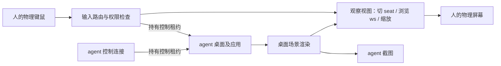

> 2026-10-07 状态：本文是历史观察/接管提案。核心输入模型已改为共享输出、共享窗口、
> 每 seat 独立当前 ws，具体实现与使用以 [多 seat 说明](cornice-multiseat.md) 为准。
> 本文的独占输出及窗口归属假设已失效；只读观察帧与暂停门禁已在特性分支实现，见 [对接说明](cornice-desktop-api.md)；
> 物理输入接管仍未实现。

# cornice：多 seat 的观察、浏览与接管

日期：2026-10-07。本文是下一阶段的设计分析，**不是已经实现的接口说明**。
现有 fork 已实现多个虚拟 agent seat 的并行输入与输出隔离；本文中的
观察视图、控制租约、接管及 Cornice 界面尚未实现。

## 1. 核心结论

人选择 agent seat 时，默认只改变人的观察目标，不改变 agent 的输入归属、
应用焦点、活动工作区、输出尺寸或窗口布局。人可以跟随 agent，也可以浏览
该 seat 的其他工作区。只有显式接管后，人的输入才进入 agent 的应用。

必须分开三个对象：

- **SeatDesktop**：应用所属的桌面；拥有窗口、工作区、实际焦点、实际鼠标、
  虚拟输出、剪贴板和输入法。不能因为有人观看就迁移窗口或重建应用连接。
- **ObserverView**：某个人在某块物理屏幕或预览窗口里看什么；拥有观察目标、
  跟随/浏览模式、浏览工作区、缩放、平移、自己的观察指针和返回位置。
- **ControlLease**：谁可以向某个桌面写入；默认 agent，接管期间人，停止期间无。
  一个桌面同一时刻只允许一个交互控制者，可以有多个观察者。

Wayland 的 `wl_seat` 是输入设备及其焦点的组织单位，不自带上述观察视图、
只读权限或协作接管机制。它们是 compositor 和 Cornice 的策略。

人的观察覆盖层不进入 agent 截图。读取画面与发送应用输入是不同通道。

## 2. 操作模式

| 模式 | 人看到什么 | 人能做什么 | agent 状态 |
| --- | --- | --- | --- |
| 自己的桌面 | 人原来的桌面 | 正常操作自己的应用 | 各 agent 独立运行 |
| 跟随，只读，默认 | 指定 agent 当前活动工作区及真实鼠标 | 退出、选其他 seat、缩放、平移、转浏览、申请接管 | 正常运行，切 ws 后观察画面跟随 |
| 浏览，只读 | 指定 agent 的某个已有 ws，独立于 agent 当前 ws | 切换浏览 ws、缩放、平移、回到跟随 | 正常运行，其实际 ws 和焦点不变 |
| 人接管 | agent 桌面的真实活动 ws | 应用输入、真实切 ws、打开/关闭/移动窗口等获准操作 | 交互写入暂停；失效的旧命令拒绝 |
| 暂停 | 桌面画面可继续显示 | 只读；可以选择接管或恢复 agent | 没有交互控制者 |

不建议首版加入两者同时写同一桌面的协作模式。两个鼠标并不能消除单个应用
内部的编辑、选择、弹窗、拖拽、剪贴板竞争。并行写应发生在不同 seat。

“暂停”指停止新的自动化交互及控制命令，不承诺冻结应用进程。已经发出的
网络请求、下载、后台保存仍可能完成。需要冻结整个 agent 任务时，执行器也
必须提供任务暂停和确认，不能只在 compositor 层丢弃键鼠。

## 3. 只读到底禁止什么

只读不仅是不转发按键。以下行为也不能落到目标应用或桌面：

- pointer enter/motion、点击、滚轮、手势、触摸、笔输入；hover 也不能改变目标应用。
- 键盘、修饰键、重复事件、IME commit/preedit、应用快捷键。
- 抢焦点、激活窗口、移动/缩放、关闭/最小化、修改分组或布局、拖放。
- 真正切换 agent 活动 ws、创建/销毁 ws、移动窗口到别的 ws。
- launcher/exec、应用菜单、通知动作、托盘动作、剪贴板粘贴。
- 控制 API、虚拟输入协议及桌面动作经由另一条路径绕过模式检查。

观察窗口中的滚轮可以用于观察视图缩放/平移，但不能用于网页滚动。
观察 ws 的选择是本地查看动作，只能选择已有 ws；不存在的 ws 返回错误，
不能复用当前 `seat workspace` 自动创建工作区的行为。

只读模式保留少量合成器/观察器本地动作白名单。直接禁用物理键鼠会使人无法
退出；保留全部原有快捷键则会留下 `close`、`exec` 等写操作路径。
必须在 keybind 和应用事件派发之前区分两种动作。返回人的桌面和紧急停止的
按键必须由 compositor 处理，不能被应用 keyboard grab、锁定鼠标或快捷键
抑制协议吞掉。锁屏时仍遵守锁屏路径，不借逃生快捷键绕过认证。

这是一条**交互权限边界**。当前同 UID 的主连接仍能使用全局特权 IPC；仅给
预览界面加“只读”不会形成 OS 安全沙箱。若要对不可信 agent 强制权限，需
额外隔离 UID/IPC/文件/特权协议，并让控制代理成为唯一获准的写入口。

## 4. 浏览其他 ws 是新增的渲染能力

当前 `SeatDesktop::switchWorkspace()` 会调用 `Monitor::changeWorkspace()`，
并更新 agent 的真实焦点。当前渲染可见性、工作区动画和 frame callback 也与
`Monitor::m_activeWorkspace` 关联。因此不能用它实现只读浏览。

跟随可以复用 agent 当前输出的帧，但输出镜像只能展示当前活动 ws。要浏览
其他 ws，需要按观察视图指定的工作区生成场景，不修改实际活动 ws：

1. 增加显式的渲染上下文：目标桌面、目标 ws、原始布局、视图变换、覆盖层策略。
2. 将“实际活动/有输入焦点”和“存在观察渲染需求”分开；正确处理非活动 ws
   的 surface frame callback、damage、presentation 和 buffer 生命周期。
3. 保持应用原有 geometry、configure、scale 和输出归属。观察屏幕尺寸变化
   只缩放画面，不触发 agent 应用重新排版；不要借显示预览迁移窗口或修改输出。
4. 避免通过临时 `forceRendering` 或切换全局 ws 得到一帧，再切回来。
   临时状态仍会产生焦点、动画、激活及 agent 截图竞态。
5. 分开 agent 的真实鼠标和人的观察指针。人浏览别的 ws 时应提示 agent
   当前在哪个 ws，不在错误画面上展示可误解的 agent 鼠标位置。

有观察者时应调度必要帧；没有观察者时可以停止额外视图渲染。应用自行在后台
暂停的行为不能凭 compositor 保证消失，应测试真实浏览器/视频/终端。
观察可以让后台应用更频繁地绘制，这是资源开销，不应产生输入或布局修改。

建议先用 Cornice 的全屏/窗口式观察器承载画面，保留人的原桌面和输出。
用户体验仍然是“切到 agent 桌面”，底层则是人自己的观察视图。无需把物理
输出或人的应用迁入 agent 的 seat。随后再优化为 compositor 直接显示视图，
减少复制开销。观察其他 ws 所需的场景能力仍必须由 fork 提供。

## 5. 接管是一个原子的控制交接

不要创建第三个应用 seat 或重新绑定应用的 Wayland 连接。接管后仍使用原
agent seat 的应用焦点、输入法及鼠标，只将获准输入的控制者改成人。
物理设备的原始归属和事件接收可以保留，派发时再路由到目标桌面。

建议流程：

1. 进入交接状态，停止接受该桌面的新写命令，递增控制代次。
2. 取消旧代次排队的输入/桌面命令；旧连接重试也不得恢复写权限。
3. 清理 agent 按住的键、修饰键、按钮、重复、拖拽、约束及 IME preedit。
   必要释放事件是完成协议状态清理；已送达应用的动作不能倒退，某些应用
   会在 release 时完成动作，不能承诺事务回滚。
4. 授予人控制租约，确认观察画面与真实 agent ws 一致后接受应用输入。
5. 归还时释放人的按下状态，阻断跨交接的 held-key/release 泄漏；人回到只读。
6. agent 收到新代次、实际 ws/窗口/焦点和新截图，重新判断当前状态再继续。
   不重放接管前按旧画面计划的点击。

人正在浏览另一个 ws 时点接管，首版建议先回到 agent 当前真实 ws 再交接。
若支持“接管并跳到我看的 ws”，那是接管完成后的真实切换，需要在界面上
明确说明，不能在只读阶段偷偷执行。

租约需要 owner、generation、到期/心跳和明确的撤销原因。观察器断开时释放
观察引用；人控制连接崩溃时停止输入并清理 held state，保持暂停，而非自动
恢复 agent 写入。恢复由明确的执行器交接流程完成。普通切换观察 seat 时
若仍有接管租约，也要完成释放，不能留下后台隐形控制。

## 6. 必须覆盖的接口与状态

下列是候选语义，**不是可运行的 hyprctl 命令**：

| 接口 | 语义 |
| --- | --- |
| view.create / attach | 观察者选择 seat 和显示位置，默认只读 |
| view.follow | 观察目标的实际 ws 和焦点变化 |
| view.workspace | 只改变自己的浏览 ws，不创建 ws 或改变目标状态 |
| view.detach | 返回自己的桌面，恢复观察前状态 |
| control.acquire / release | 原子接管/归还，返回控制代次 |
| control.pause / stop | 禁止新的控制动作并清理输入状态 |
| seat.snapshot / subscribe | 读取所属桌面及有序状态事件，供 UI 和 agent 同步 |
| input / desktop.action | 带 seat、控制代次和权限验证的写入口 |

状态至少包含稳定的 seat 身份及生命周期代次、控制者、租约代次、真实 ws、
观察 ws、窗口身份、焦点、鼠标、输出几何/缩放/旋转、锁定/暂停原因。
同名 seat 删除重建不是同一个目标。窗口引用也需要识别销毁和地址复用。
截图与点击应携带帧/布局版本：工作区、窗口或几何已变化时，拒绝明确依赖旧
视图的动作并让调用方重新取状态。不能要求每个动画帧都使输入失效，否则
视频/动画界面无法操作；版本验证针对实际依赖的目标与布局。

全屏或窗口式观察器中的接管要做坐标逆变换：缩放、黑边、裁剪、HiDPI、旋转
均需处理。黑边上点击不能送进应用。后续有多物理屏幕时，每个视图保持独立
观察状态；一个 seat 同时仍只允许一个控制租约。

## 7. Hyprland 与 Cornice 的分工

| 层 | 需要补的能力 |
| --- | --- |
| SeatDesktop / 输入派发 | 控制者策略、代次校验、物理输入路由、完整输入释放 |
| keybind / dispatcher / IPC | 目标 seat 和调用来源显式化；观察动作白名单；写入口统一验证 |
| renderer / workspace presentation | 独立观察渲染、非活动 ws 帧需求、独立覆盖层和截图源 |
| focus / activation / layer / grabs | 看画面不抢应用焦点；接管保持应用所属 seat；逃生动作优先 |
| 生命周期 / lock / idle | 锁屏覆盖所有观察与捕获；解锁不自动恢复控制；热拔插及重建失效 |
| Cornice 插件 | seat 选择器、跟随/浏览/接管标记、ws 导航、暂停/紧急停止、返回自己的桌面 |
| agent 执行器 | 暂停与交接确认、取消排队动作、断线处理、重取截图后恢复 |
| 应用及系统服务 | 独立 profile/DBus；通知和 portal 标明来源；音频/摄像头/共享文件策略 |

这些改动主要在 compositor 的桌面状态、输入策略和渲染层，加上 shell 与
agent 执行器配合。该 native Wayland 路线不要求修改 Linux 内核、DRM 或
libinput，也不要求普通应用理解 Cornice 观察模式。XWayland、额外物理键鼠、
触摸/笔和每 seat 多输出仍是单独的后续能力，不能算进目前已完成范围。

通知、polkit 和 portal 弹窗尤其需要来源/动作边界：只读观察中不能误点 agent
的授权操作；认证 UI 应交给人，agent 不能代输人的解锁凭据。系统睡眠、
配置重载、注销等全局动作不属于普通 seat 控制权限，需走独立策略。
剪贴板和拖放默认继续隔离，跨桌面传递需要显式动作，不能因观察自动同步。

## 8. 建议的实现顺序与验收

1. **控制策略与只读跟随**：在已有多 seat 上增加只读视图、逃生动作和状态事件。
   真实应用持续输入/弹窗时观察不改变其焦点、ws、光标或布局；所有观察输入
   和原有写快捷键被隔离；锁屏遮住画面并撤销控制。
2. **独立浏览 ws**：补观察渲染上下文和帧调度。人看 ws B、agent 操作 ws A，
   两边同时更新；窗口所属输出、configure 尺寸、应用焦点保持不变。
3. **接管/归还**：做租约代次及执行器握手。按住 Shift/鼠标、拖拽、IME、
   popup/grab 期间接管；并发旧输入拒绝，归还后 agent 用新状态继续。
4. **完整异常与资源策略**：视图/agent 崩溃、锁屏、seat 删除重建、输出拔插、
   缩放旋转、多视图、服务弹窗。断开保持暂停，其他 seat 与人的桌面正常。

验证必须在嵌套/headless compositor，用真实 Wayland 应用和真实协议事件。
只读验收同时检测：应用收到的事件、桌面状态未被修改、实际观察画面正确。
仅靠输入框没出现字不够；只靠预览截图也不能证明没有抢焦点。
保持人 + 三个 agent 的并发基线，并加入两观察者看同一 seat、只有一个控制者
的竞争测试。继续使用独立运行时，不拿正在使用的桌面测试锁屏或控制切换。

## 9. 证据与现有代码入口

- [Wayland 核心协议](https://wayland.freedesktop.org/docs/html/apa.html)：
  `wl_seat`、pointer/keyboard focus、surface frame callback。观察/接管是
  本文基于这些语义提出的 compositor 设计，不是标准已有功能。
- [当前多 seat 用法与范围](cornice-multiseat.md)。
- `src/managers/SeatDesktop.hpp/.cpp`：额外 seat 注册、输入与实际 ws 切换；
  `inputAllowed()` 目前只检查生命周期、输出可用性与 session lock，没有控制租约。
- `src/render/Renderer.cpp`：窗口可见性及工作区帧事件依赖实际输出/workspace。
- `src/managers/input/InputManager.cpp`、`src/ipc/s1/Commands.cpp`：
  物理输入与当前特权控制路径，需要统一来源和策略。
- `src/desktop/state/FocusState.cpp`、`src/output/Monitor.hpp`：真实焦点与输出状态；
  不能借全局 current-seat 切换实现观察。

本文分析未实测未实现的观察/接管能力；它定义了接下来应实现和验证的行为。

## 10. 另一条路线：给 agent 一个 ws

需要先区分三个维度：seat 管输入与焦点，workspace 管窗口组织，output 管
显示几何与输出渲染。一个 agent 可以只拥有一个 ws，同时仍拥有独立 seat。
“一个 ws”与“一个 seat”不是二选一。

若只保留人和 agent 共用的默认 seat，给 agent 一个隐藏 ws，再按目标窗口
发送普通虚拟键鼠，仍会竞争 seat 的 keyboard/pointer focus、修饰键、grab、
剪贴板和输入法。临时切 ws/切焦点后再切回也会产生应用事件与观察竞态。
它不能满足两边同时进行通用桌面操作的原要求。专用应用 API，例如浏览器
自动化，可能在共用 seat 下完成部分后台任务，但不是通用桌面输入的替代。

公平的比较是下面两种都保留独立输入 seat 的方案：

| 维度 | 独立 seat + 独占虚拟输出 + ws | 独立 seat + 独占 ws，复用物理输出关联 |
| --- | --- | --- |
| 人与 agent 并行输入 | 已有隔离基础 | 可以实现，仍需保留同类 seat 状态 |
| agent 隐藏时工作 | 自己的输出维持渲染和输入 | 需让输入目标、焦点和帧调度独立于物理输出的活动 ws |
| 截图与布局 | 原生输出几何及捕获路径可复用 | 需 workspace 场景捕获与稳定 viewport |
| 只读跟随 | 可展示 agent 当前输出；只读策略仍需新增 | 需要 workspace 观察视图；直接切实际 ws 不足以隔离 |
| 只读浏览其他 ws | 仍需独立观察渲染 | 同样需要；固定单 ws 时该需求缩小 |
| 弹窗/全屏/layer-shell | 输出归属提供现成边界 | 需显式 workspace/桌面归属，不能覆盖人的前台输出 |
| 接管/归还 | 控制租约与输入清理 | 同样需要；不能因显示该 ws 自动取得控制权 |
| 独立分辨率/缩放 | 输出天然提供稳定几何 | 要决定固定 viewport，避免跟随人的屏幕变化重排 |
| 多 agent 扩展 | 每 agent 多一个输出和控制器 | 每 agent 多一个控制器及后台 workspace 场景 |
| 当前代码成熟度 | 已实测人 + 三个 agent | 尚未实现或实测，需解开 monitor 与活动 ws 的耦合 |

ws 方案可以减少 output 对象和部分输出调度，但图形 agent 仍需要稳定的截图
画布、buffer 和帧更新。不能据此承诺显存或 CPU 明显下降；要在相同应用、
分辨率和截图帧率下测量。有多少 agent 持续绘图，比桌面的命名方式更关键。

纯 ws 后端需要重点改动：

1. 将 `SeatDesktop` 的所属窗口/ws 集合与 `monitor()` 的一对一关系分开。
   多个 seat 的真实操作 ws 可以共用同一个物理输出关联，但只显示一个人的
   前台视图，所有输入命中必须先限定桌面/ws。
2. 将 agent 的焦点与可操作性从“物理输出活动 ws/DPMS”中分离，同时保留
   全局锁屏与暂停策略。人在该输出换 ws，不能使 agent 键盘失焦或被重新路由。
3. 为隐藏 ws 提供稳定布局和场景渲染需求，不用物理 monitor 切换来取截图。
   全屏、popup、layer、通知及激活请求都不能越过桌面所属边界。
4. 人通过独立观察视图看 agent ws。观察状态、agent 真实操作 ws 和实际
   物理输出显示内容仍然是三份状态，不能用一个 activeWorkspace 表达。

建议产品上默认“一个 agent 一个工作区”，底层首版继续使用独立 seat +
隐藏虚拟输出。让 Cornice 的工作区入口打开该 agent 的只读视图，用户无需
管理显示器；agent 可以限制为单 ws。这样保留现有已验证的输入/输出基础，
同时得到简单的工作区体验。只有实测输出数量带来明确资源问题，或产品确实
需要多个控制域直接共用物理输出关联时，再引入纯 ws 后端。

后续公共模型可以是 `AgentDesktop = InputSeat + WorkspaceSet + RenderTarget
+ ControlLease`。`RenderTarget` 可以采用虚拟输出，也可以采用 workspace
场景。观察和控制 API 不应暴露“必须切物理 monitor”这一实现前提。
