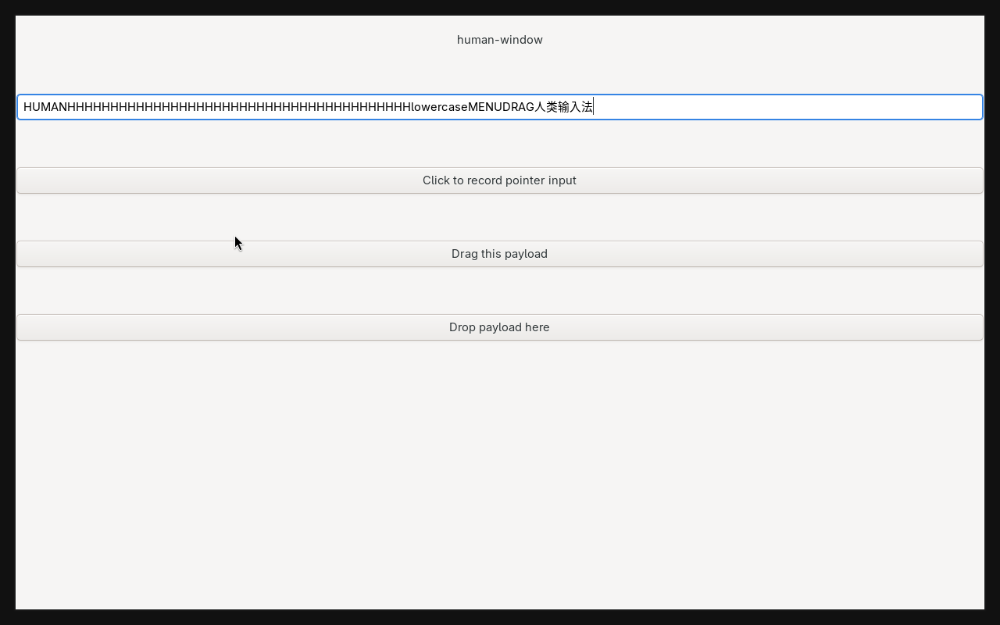
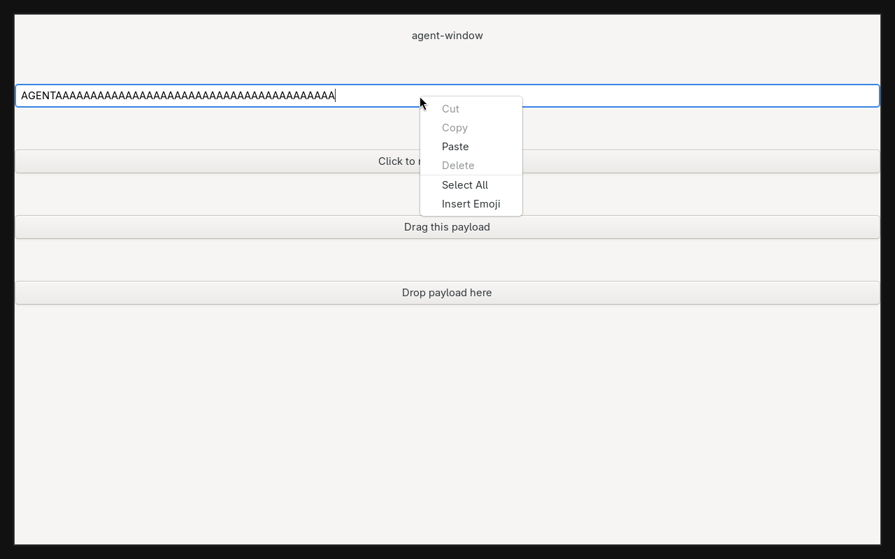
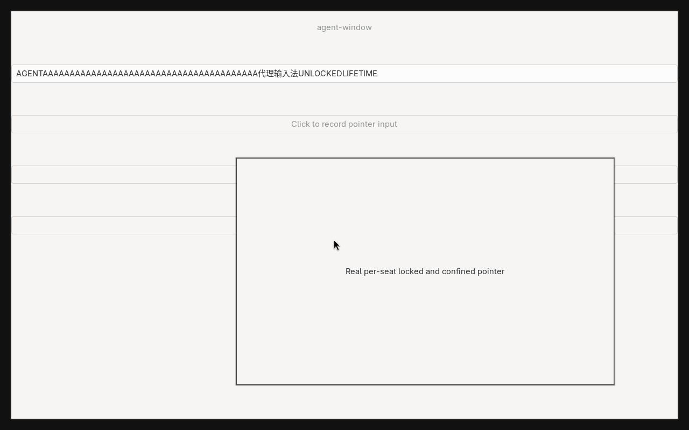
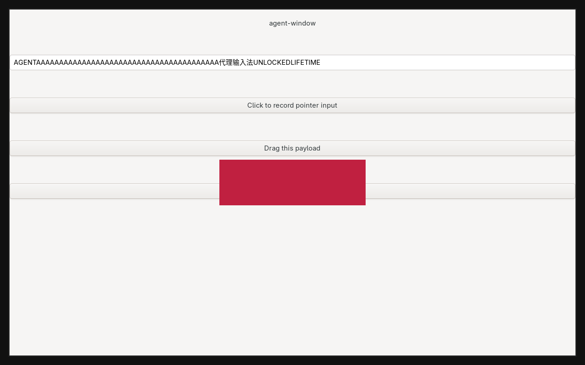

> 历史验证记录：这里验证的是此前的每 seat 独占输出模型。
> 当前共享工作区版本见 [新验证记录](cornice-shared-workspaces.md)。

# Observed multiseat verification — 2026-10-07

The implementation ran in **one fork compositor process**, with two real
Wayland seat identities and two 1280×800 independently rendered headless outputs.
The parent was a private headless Mutter instance. Both GTK applications,
virtual protocol input drivers, input methods and clipboard clients connected
to the fork's actual Wayland sockets. No product path uses simulated input.

The human's installed Hyprland process stayed running. The fork had no DRM
backend, its own runtime/DBus/config, and all 11 discovered host physical device
names disabled before startup. Input was sent only to the private fork.

## Results

- Upstream unit tests: **647/647 passed** across 69 suites.
- Upstream integration regressions: **5/5 passed** —
  keyboardModifiersMergedOnFocus, pointerWarp, xdgInteractive,
  popupOpacityInheritsParentFade, xdgActivationSerial.
- Interleaving: 20 alternating rounds and 20 simultaneous rounds per seat.
  Exact final strings were checked; no keys went to the other application.
- Agent workspace switches preserved the complete primary cursor, active
  window, workspace and monitor state in every alternating round.
- Actual GTK button clicks, Ctrl+C/Ctrl+V, primary selection and data-control
  clipboard reached only the owning seat. Agent Shift did not affect human text.
- Agent GTK menus were visually visible while human typing continued. Actual
  GTK drag payload `agent-window-payload` reached the agent's drop target only.
- Two real IME protocol clients committed Chinese into their own GTK entries.
  Simultaneous keyboard grabs each received exactly three own key presses;
  neither GTK entry received grabbed keys.
- Real session lock rejected agent pointer/typing, accepted human lock-surface
  input and restored agent application input after unlock.
- Release of `wl_seat` before virtual-input child destruction remained valid.
  Pointer lock, relative events and confinement left primary state unchanged.
- Agent xdg-activation tokens accepted the agent’s input serial and kept focus
  on its own window.
- Client-initiated window move and resize changed real agent window geometry;
  human typing continued and its state stayed unchanged.
- An actual layer-shell surface without an explicit output mapped to the agent
  output. Hyprland focus grab and its keyboard input stayed on the agent seat.
- Removal while Shift, a key and a mouse button were held left old devices inert.
  Same-name recreation used a new socket; no old client was reassigned. Three
  additional disconnect/collection cycles passed.

The machine-readable [result record](cornice-multiseat-results.json) retains the
observed states and test outcomes. Full temporary logs for this run are under
`/tmp/hyprland-multiseat.5Q1cLV`; the test harness reproduces them on another run.

Debug coverage files from repeated builds emitted GCDA merge warnings. The
successful test outcomes above are execution results, not a coverage percentage.

## Visually reviewed output captures

These are actual `grim` captures from the tested compositor. The agent menu,
cursor, moved/resized window and layer were inspected after their corresponding
protocol and state assertions passed.

Human application, including its own Chinese IME text and cursor:

Agent application with its visible GTK popup while the human continued typing:

Agent window after client-initiated move and resize:

Agent layer-shell surface (the red protocol-test surface) on its own output:

## Limits of this evidence

### Multiple-seat follow-up (2026-10-07)

The follow-up run used `MULTISEAT_EXTRA_SEATS=1 MULTISEAT_REGRESSION=1` and the
same private/nested compositor arrangement. A human and three agent seats typed
simultaneously for 20 rounds per seat. Exact final text matched on all four
clients; switching the extra agents' workspaces preserved the primary state.
One extra agent created its virtual pointer without a suggested seat: its
connection selected its own controller and left the human cursor unchanged.

Hot output creation/reservation initially exposed a registry race: a primary
client could bind an output announced before reservation and be disconnected.
Primary clients now retain output bind eligibility; agent connections still
expose only their own output. This is interaction isolation, not capture secrecy.
The lock test helper explicitly selects its human output rather than relying on
registry enumeration order. GTK input readiness is checked before typing.

The full two-seat scenario and all **5/5** upstream integration regressions
passed afterwards; the rebuilt binary also passed **647/647** unit tests.
The resize regression uncovered an initial drag motion being throttled by the
previous drag's refresh interval. The first movement of each drag is now
accepted; repeating the same coordinate may otherwise never produce another
motion event. Full logs are in `/tmp/hyprland-multiseat.yAchHO` and the observed
states are in the [multiple-seat result record](cornice-many-seats-results.json).
This establishes four-seat operation, not a measured high-seat capacity limit.

The observer, independent workspace browsing and takeover described in the
[design proposal](../cornice-observer-control-design.md) are not implemented or
validated by these results.

This proves the native Wayland/virtual-seat path exercised above. It does not
certify secondary XWayland, physical-device reassignment, secondary touch/tablets,
hardware DRM combinations or every application/profile/DBus behavior. It does
not constitute Cornice AI-agent integration or OS security isolation. See the
[usage and scope document](../cornice-multiseat.md).
