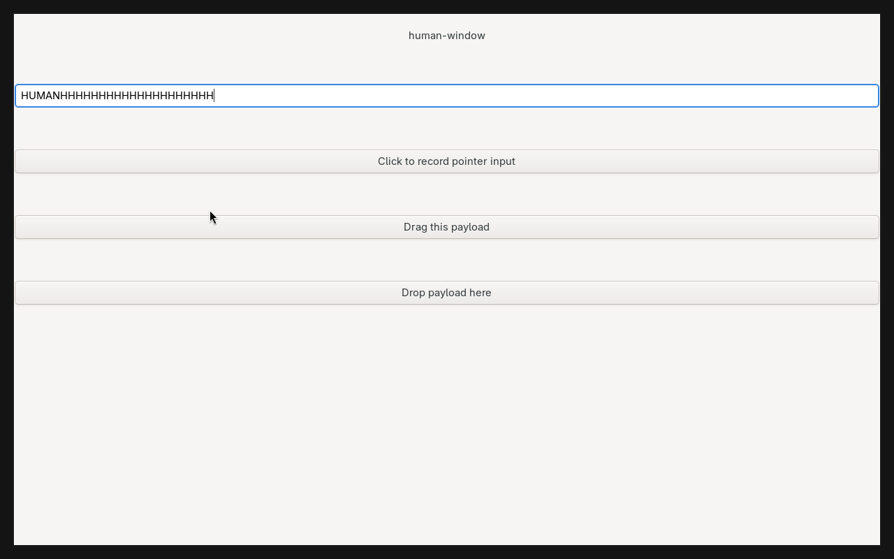
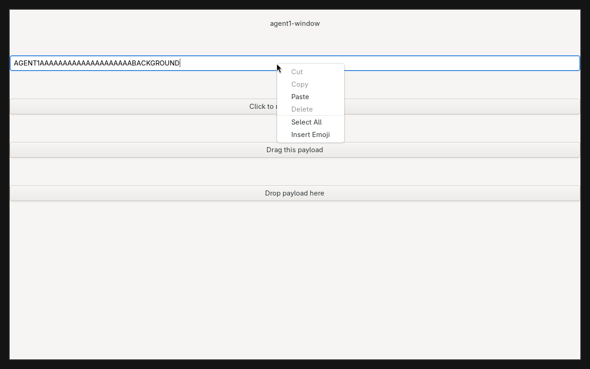
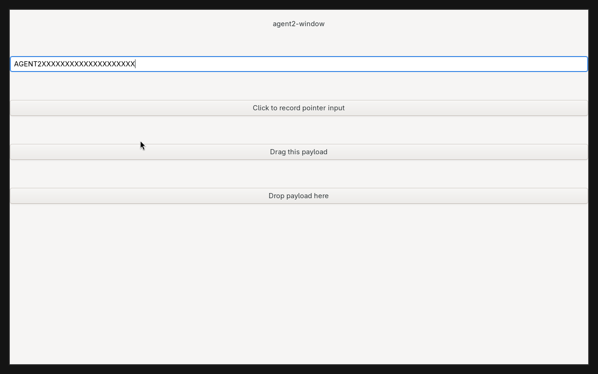
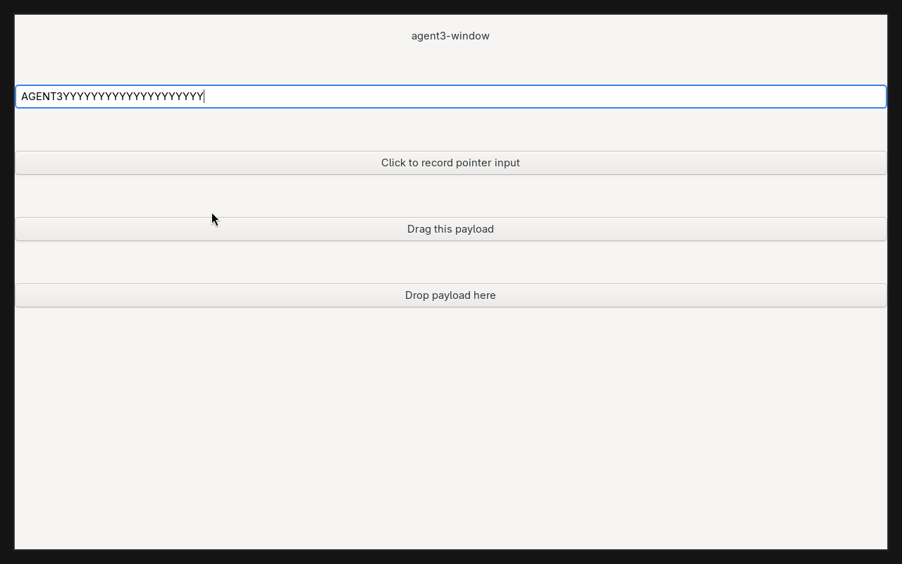
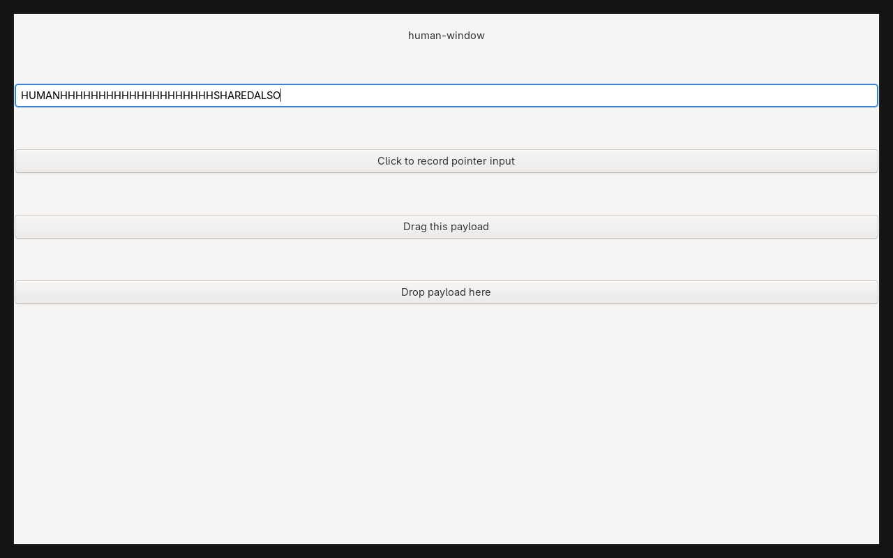

# 共享工作区与独立 seat：实测记录

日期：2026-10-07。使用本 fork 的 Debug 构建，底座提交
`5a78b5e927345860a27e2893bf894f97ee620c48`。复现命令见
[使用与构建说明](../cornice-multiseat.md)。

## 实际运行环境

一个测试 Hyprland 进程、一个 1280×800 输出、四个真实 Wayland seats：
默认 `Hyprland` 和 `agent1`、`agent2`、`agent3`。
人的输出停在 ws1，三个 agent 分别操作 ws10、ws11、ws12。
没有为 agent 创建独占输出，没有临时切换人的桌面再输入或截图。

父合成器是 headless Mutter。测试实例使用独立 runtime、DBus、配置和缓存，
`AQ_DRM_DEVICES=/dev/null`；启动前禁用宿主发现的 12 个物理输入设备名称。
所有注入只进入测试实例。宿主已安装 Hyprland 的进程及启动时间保持不变。

GTK 3 窗口、虚拟输入、两个 IME 协议客户端、剪贴板客户端、指针约束和锁屏
都是实际协议连接；测试程序中的标签仅用于识别窗口。

## 通过的检查

- **647 个上游单元测试通过**，69 个 suite。
- 四个 GTK 窗口并发接收精确文本；人的鼠标、焦点、工作区和输出状态保持不变。
  agent 的按键/修饰键不会发给人的窗口。
- 从主 socket 和 agent socket 启动的客户端都能绑定四个 seats。
- 四个 seat 在不同 ws 的截图内容不同；后台追加文本后截图更新，不改变人的状态。
- agent 切到 ws1，实际输入到人启动的同一个 GTK 窗口；人随后继续输入。
  原 agent ws10 的窗口没有收到这些键。
- 两个真实 IME keyboard grabs 各自收到三次按键；应用没有收到被抓取的键，
  两个 grab 没有交叉收到对方的键。这不代表 GTK 同一应用的多 seat 中文输入已兼容。
- `wl-copy` / `wl-paste` 显式选择 seat 后，普通剪贴板与 primary selection
  分别读回自己的数据。
- agent 在隐藏 ws10 完成 GTK 拖放，真实字符串 payload 进入其目标控件；人同时输入。
- 隐藏工作区的 GTK 菜单保留抓取，人的输入继续进入人的窗口。
  菜单截图与菜单前截图有 **132489 个不同的像素字节**，并人工确认菜单可见。
- 人的 socket 启动的窗口位于 ws10，其 xdg activation、指针锁定、相对运动、
  confinement、客户端移动和缩放均使用请求的 agent seat；拖动没有把窗口迁到人的 ws1。
- 同一客户端随后移至共享 ws1，agent 再次拖动窗口，人的焦点、鼠标、当前 ws
  及该 ws 记住的人的上次焦点均不变。
- 原生 `wl_keyboard` 子资源在释放父 `wl_seat` 后仍收到八次新按键，合成器保持运行。
- 真实 session lock 拒绝 agent 输入和截图，没有写出锁屏截图；解锁后恢复操作。
- 删除 seat 时保留真实 GTK 窗口及尚存的协议子资源。持有 Shift 和鼠标按钮的旧设备
  被禁用；同名 seat 重建后旧设备仍不能输入，也不能改变新 seat 状态；人的输入继续可用。
- 上游单 seat 回归中，`keyboardModifiersMergedOnFocus`、`xdgInteractive`、
  `popupOpacityInheritsParentFade`、`xdgActivationSerial` 实际执行并通过。
  `pointerWarp` 返回成功，但其上游测试在 headless 环境主动跳过，不能计为实际验证。
  多 seat 套件另有实际坐标、约束和拖动断言。

[机器可读结果](cornice-shared-workspaces-results.json) 保存上述结果。
完整日志、协议程序和额外截图保留在 `/tmp/hyprland-multiseat.rGAuC4`。
测试退出清理时输入客户端的 Broken pipe 是测试合成器关闭后的输出。
测试插件已强制重建，避免旧头文件布局造成 ABI 不匹配。

## 人工查看的实际截图

人停在 ws1：

agent1 在隐藏 ws10，菜单可见：

另外两个 agent 分别在 ws11、ws12：

agent1 切到共享 ws1，并与人输入同一个窗口：

## 验证边界

这是合成器底层和控制接口的验证，没有替换宿主桌面，也没有接入 AI 模型。
本版本截图只包含工作区窗口、弹窗和相应 seat 的光标/输入法弹窗，
不包含人的输出级 bar、壁纸和 launcher。

已验证原生 Wayland GTK 3。GTK 3 的热新增 seat 和默认 seat 输入法有
[已记录的限制](../cornice-multiseat.md#已知兼容边界)。其他工具包、复杂应用、
XWayland 多输入焦点、物理输入设备分配、多输出热拔插及 GPU 性能还需对应验证。
本记录不承诺输入隔离能隔离共享应用的数据、文本插入位置或窗口布局修改。
只读观察、跟随、接管及 workspace ACL 不属于这次简化版本。
