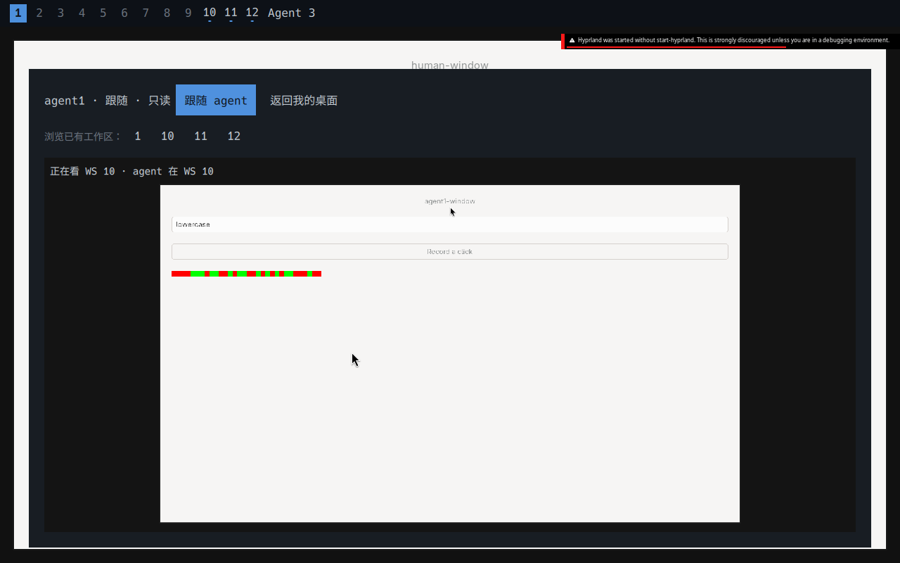
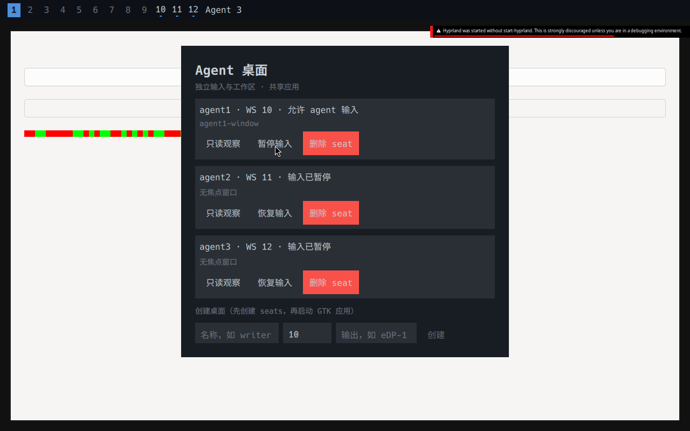

# Agent 桌面对接验证

## 2026-10-07 human/full 锁与私有输出实现

此次实现仅在特性分支，物理会话仍运行旧 `38351820`，新锁协议未在宿主启用。
没有新增旧命令兼容层；dotfiles 全局 hyprctl 代理与转换器已删除，直接使用系统工具
及原生 Lua API。当前安装版本的 native API 私有回归：`/tmp/ad-zrj541x2`，实际 GTK
中文粘贴及 Ctrl 释放、窗口切换、全屏/置顶/浮动/尺寸、中文带引号 WS 与 DPMS 均通过。

新锁实现工作树验证：`/tmp/ad-okepdwzi`；全新 `--desktop --copy` 安装产物验证：
`/tmp/ad-vdytw0aj`；解锁仅在 Wayland 确认后报告完成的最终复跑：
`/tmp/ad-r0tvjok7`。测试真实调用安装后的程序、协议、原生 QML/Qt 组件及 Cornice UI，
没有操作宿主锁屏、关屏或睡眠。通过以下实际结果：

- 三个 Agent 独立 private 输出；两个预创建 Agent 操作同一个 Agent 启动的 GTK 输入框。
- active/continue 在 human 锁后仍切 WS、实际输入、启动 GTK 和截自己的画面；pause 被撤销。
- Agent 可以操作人的同一个 WS；持续物理截图没有应用内容，Agent 导出内应用时钟继续变化。
- 人侧观察 SHM/纹理在锁后清空；原始 private/window 导出及旧帧输入被拒绝。
- 真实 Chrome 通过 pipe CDP 运行 JavaScript；128 KB 请求分段写入，没有命令重放。
  暂停关闭授权连接；重新 resume/bind 后用新 endpoint；human continue 保留授权；full 拒绝旧 endpoint。
- 真实 PAM permit/deny 认证、主 seat 密码框输入、提供者 SIGKILL、遗失锁恢复；失败保持锁。
- 人的 DPMS off 不关 private 输出；未知 headless 输出/模式变化加入保护并重新确认实际呈现。
- guardian 在 human 锁中退出原子升级全锁，全部 Agent 暂停；重启 Cornice 恢复认证而不恢复授权。
- logind 测试夹具在私有 system bus 上传递真实 inhibitor FD，检查 block/delay/lid、
  full secure 先于 Suspend、模拟唤醒与合盖。没有执行宿主 Suspend。
- private home 输出丢失，即便该 seat 正在看人的 WS 也被撤销；人的 WS/focus/cursor 保持不变。

主 seat 新原生锁界面已目视检查：`/tmp/ad-okepdwzi/cornice-native-lock.png`，
是不透明的真实锁 surface，含时钟、密码框、按钮及 human/full 提示。该界面仍未接入
旧锁的壁纸/模糊/主题/指定主屏配置，不能声称配置完全等价；XKB compose 不是独立 IME。

既有桌面专项工作树回归通过：`/tmp/ad-45cbd37y`，GTK/Chrome/kitty/Qt 输入、只读观察、
真实面板点击、生命周期撤销均覆盖。实际观察约 14.9 fps，最大延迟 128 ms（58 samples）。
既有 shell headless、lock、idle-lock 回归分别见 `/tmp/cornice-headless-regression.log`、
`/tmp/cornice-lock-regression.log`、`/tmp/cornice-idle-regression.log`。headless 的配置重载
测试现在等待实际新配置生效，不将一次性 reload IPC 回复当作已应用。

新版本物理合盖/睡眠、DRM 多输出及 PAM 用户本人解锁仍未验收。此前物理 GTK 跨 seat
失败是下方旧版本的历史记录；新 source 修复在私有实例通过，不能将物理结果改写为通过。

## 先前独立 seat 阶段记录

本轮完整对接证据：`/tmp/ad-e6_6n7ax`；约 **14.94 fps**，最大绘制到观察时间 **124 ms**。
文末界面截图来自 `/tmp/ad-fpovr9l2`。
Hyprland 多 seat 回归证据：`/tmp/hyprland-multiseat.ugPdp5`。

日期：2026-10-07。cornice `codex/agent-desktop`；Hyprland `codex/cornice-agent-desktop`。
没有合并 main、发布或替换宿主的 Hyprland。宿主会话 PID 40893 保持原来的启动时间。

## 真实场景

一个输出，人在 ws1，三个 agent 分别在 ws10/11/12；可以切到相同 ws、共享窗口。
下列能力通过实际客户端结果确认：

- GTK 3 隐藏窗口的点击、组合键、中文输入；人的 ws/focus/cursor 不变。
- 重复写请求身份不会重复点击；切 ws 后拒绝旧截图坐标；旧 binding 被撤销。
- 截图后启动另一个真实 GTK 应用抢走焦点，旧帧文字输入被拒绝；两个应用均未收到错误文字。
- 暂停释放 held Shift，旧虚拟设备保持无效；旧连接创建替代键盘/指针被协议拒绝。
- Google Chrome 154 使用专用 profile，页面实际收到点击与中文文字。
- kitty 0.49.1 在后台执行真实输入的 shell 命令，包含中文与 Return。
- Qt 6.11.2/Quickshell 0.3.1 TextInput 实际收到中文。
- 只读跟随/浏览不改变任何 seat 状态；无人选中的 ws 的真实动画也继续更新。
- 观察器消费原始帧；真人 seat 点击、输入及 Ctrl+W 未传给共享应用。
- 实际 session lock 清空画面和缓冲，解锁保持 agent 暂停；只读重开不恢复写入。
- 人的 Lua ws/窗口聚焦/通知回到应用/DPMS/带空格 argv 启动路径通过实际状态核验。
- UI 退出不终止独立桌面服务；服务正常退出、SIGKILL、重启、seat 删除符合暂停/保留窗口契约。

持续观察测试采样实际物理输出的应用绘制时钟，另读原生 view 的实际 paint 计数。
测试输出记录 fps、最大绘制到观察时间及采样数。读 PNG 的压缩时间不作为帧率计数，
性能采样使用未压缩输出；最终视觉检查仍保存 PNG。

## 回归与安装

- Hyprland：647/647 单元测试通过；multiseat 套件及其原有单 seat 集成回归通过。
- cornice：既有 headless、idle/lock；全新复制安装回归通过，core 包文件与提交一致，
  包产物的 headless 补验通过；可选原生包构建并实际运行完整桌面专项。
- 全新 `--desktop --copy` 安装后的程序、QML 模块与 RPATH 实际运行上述场景。

安装记录：`/tmp/cornice-install-feature-focus-final.log` 的复制安装套件通过；
core 包套件遇到通知点击失败，测试原先只等待图层出现，现改为等待完整卡片尺寸稳定，
并保存实际点击前截图。对包产物重跑后的全部通过记录是
`/tmp/cornice-packaged-headless-final.log`，证据 `/tmp/cn-99kXlM`。
可选原生包运行记录是 `/tmp/cornice-agent-desktop-packaged-final.log`，证据
`/tmp/ad-a0ov62jw`（14.92 fps、最大 135 ms）。
先前一次既有空闲锁屏等待也曾失败（`/tmp/cornice-install-feature-final.log`）；
复跑的复制安装和包安装均通过，尚未确定该次间歇失败的原因。

命令见 [使用说明](../agent-desktop.md)。每次运行的私有目录包含应用/合成器日志、
observer/manager/browser/Qt 截图及 `observer-performance.json`。验证输出报告绝对路径。

## 尚未验收

物理输入接管、具体执行器的真实任务/取消/状态同步与正式 fork 发版。
本机实际会话切换结果与新增失败项见下方物理会话验收。
多输出热插拔、所有 scale/transform 组合、所有常用应用及多 seat 输入法矩阵也没有
全部验收。同窗口的应用数据仍共享；Chrome 的单 seat 客户端限制按使用说明处理。

## 2026-10-07 实际物理会话验收

特性版 `38351820` 已通过原 SDDM 登录入口启动；cornice.service 正常运行，
agent1/2/3 均在实际 DRM 输出 eDP-1 上。3072×1920、2 倍缩放保留。
隐藏 Workspace 内的 GTK 点击/中文、kitty 命令、Chrome 中文、Qt 中文、切 ws、
截图、暂停/恢复与旧 binding 撤销通过。只读观察器的跟随/浏览约 14.96 fps，
已检查实际物理输出截图。测试期间有人的真实输入，逐步核对输入事件计数
与 primary 状态，观察到 3 个状态不变检查点和 5 个人主动操作检查点。

完整验收仍未通过：agent1 启动的 GTK 窗口，在 agent2 上可见但输入框不接受
第二 seat 的文字。fcitx/native Wayland IM 两种配置均复现，不能将原因归结为 fcitx。
这与以前主 seat 启动 GTK 的共享窗口通过结果不是同一个场景。

证据：`~/.local/state/cornice-agent-desktop/physical-20261007-171801/result.json`
及同目录实际截图、日志。物理会话已切换与独立应用路径通过，分别记录为真；
完整多 seat 共享窗口验收记录为假，保留此缺口。

全新安装产物的既有桌面专项也通过：`/tmp/ad-jp82ae54`，实际绘制 14.93 fps、
最大应用绘制至观察 162 ms（58 samples、44 distinct frames）。
